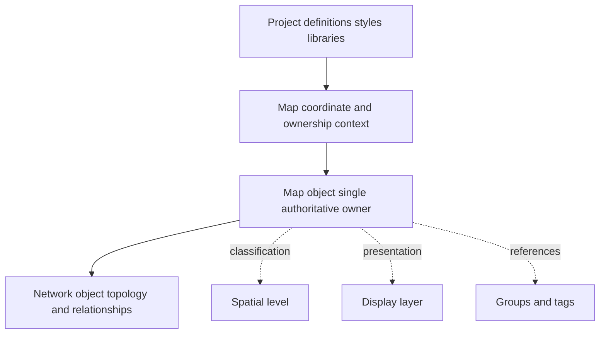
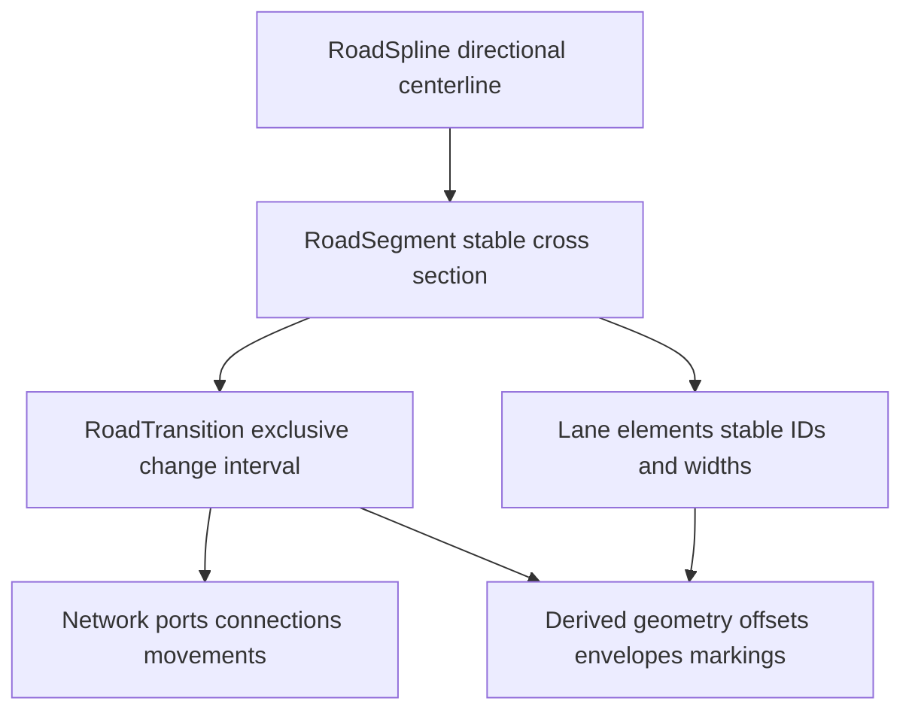
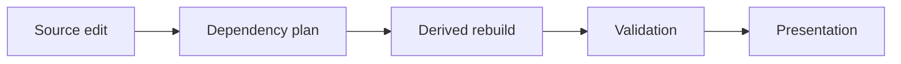
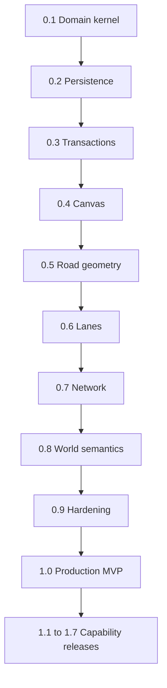

**Revision 3.0**

*Canonical product architecture implementation and release contract*

September 2026

Atlas is a standalone, game-agnostic editor for authoring fictional and simulated worlds in real-world units. This specification defines the authoritative product model, interaction rules, persistence contract, validation behavior, release governance, and conformance criteria. Revision 3.0 adopts the Atlas product name and reconciles the product README and Implementation Roadmap with the architecture established in Revision 2.0.

This document is the source of truth for product meaning and technical invariants. The Implementation Roadmap schedules those requirements into releases and work packets. The README summarizes the product for repository readers. Neither subordinate document may silently redefine a canonical term, weaken a CORE requirement, or move authoritative ownership.

| Document field | Value |
|---|---|
| Status | Canonical foundation specification |
| Current implementation baseline | `v0.1.0` Domain Kernel and Engineering Contract |
| Audience | Product design, engineering, quality assurance, technical art, and AI-assisted development |
| Authority | Normative requirements marked MUST and MUST NOT; other text explains intent and expected behavior |
| Primary orientation | Two-dimensional authoring with optional 2.5D elevation data and secondary derived previews |
| Core domain | Parametric road corridors, lane connectivity, hierarchical maps, and extensible semantic world data |
| Companion execution plan | Atlas Implementation Roadmap 1.0 |
| Maintained representations | This Markdown source and its generated DOCX edition carry the same normative content |

# Document Control

## Revision History

| Revision | Date | Summary |
|---|---|---|
| 1.0 | September 2026 | Initial consolidated product, user experience, and technical design foundation. |
| 2.0 | September 2026 | Resolved ownership, stationing, transitions, lane lineage, submaps, prefab evolution, persistence, validation, performance, accessibility, and acceptance criteria. |
| 3.0 | September 2026 | Renamed the product Atlas; established the `.atlas` package identity; reconciled the README and Roadmap; added release/version governance, evidence and stop-ship rules, canonical fixtures, roadmap traceability, and an executable AI-agent handoff contract. |

## Normative Language

| Term | Meaning |
|---|---|
| MUST or MUST NOT | Required for architectural or release conformance. |
| SHOULD or SHOULD NOT | Expected default; deviation requires a recorded rationale. |
| MAY | Optional behavior that does not change conformance. |
| CORE | Invariant that cannot change without an accepted architecture decision and, when persisted data is affected, a migration plan. |
| DERIVED | Regenerable output that is not an independent source of truth. |
| MVP, V1, or FUTURE | Capability scope label; it never weakens a CORE invariant. |
| First enforced | Earliest release in which the requirement's applicable capability is complete and release-blocking. |
| Release gate | Objective evidence required before a version may be promoted. |

## Document Authority and Precedence

The authoritative order is:

1. This specification, including accepted amendments incorporated into its current revision.
2. Accepted Architecture Decision Records that explicitly amend this specification while the next revision is pending.
3. The Atlas Implementation Roadmap, which sequences requirements and defines work packets and release gates.
4. The repository README, which summarizes current product intent and status.
5. Implementation, tests, examples, and generated documentation.

When two layers disagree, work stops at the conflict. The higher-authority document governs until the conflict is resolved and the lower-authority artifact is updated. Existing implementation is evidence of behavior, not permission to redefine the model.

**GOV-CORE-004** A roadmap, README, issue, work packet, code path, or generated artifact MUST NOT redefine a canonical term, move authoritative ownership, or weaken a CORE requirement. A detected conflict MUST be resolved through an ADR or specification correction before implementation continues.

## Resolved Decisions in Revision 3

- The canonical product name is **Atlas**. "Parametric World Cartography Editor" remains historical wording only.
- The native package identity is `atlas.project`, conventionally stored as a directory or container ending in `.atlas`. The format identifier, schema version, application version, geometry-engine version, exporter version, and plugin API version are independent compatibility dimensions.
- The Markdown edition is optimized for review, version control, and agent ingestion. The DOCX edition is a formatted distribution of the same normative content. A semantic difference between editions is a release-blocking documentation defect.
- Atlas is currently at `v0.1.0`, focused on the domain kernel and engineering contract. Persistence, interactive editing, road authoring, and production export are later release capabilities and MUST NOT be represented as already shipped.
- The roadmap's `v0.1.0` through `v1.7.0` train is the adopted capability sequence. Its post-1.x entries remain provisional until each is approved through discovery and an ADR-backed commitment.
- Every release archives an evidence bundle and is blocked by defined stop-ship defects. Feature completion without evidence is not release completion.
- Agentic work is governed by explicit definitions of ready and done, a machine-readable task contract, mandatory stop conditions, and an evidence-based response contract.

The following Revision 2 decisions remain in force:

- Every authoritative object has one owning Map. SpatialLevel and DisplayLayer are independent references rather than owners.
- RoadSpline station values use two-dimensional plan arc length in meters. Stable StationAnchors preserve semantic locations through edits.
- RoadSegments own stable cross-section states. RoadTransitions exclusively own change intervals between differing states.
- Lane identity uses stable IDs and lineage records. Array order is presentation and offset order only.
- A RoadSpline cannot span Maps. Cross-map travel uses explicit paired Portal endpoints and transform mappings.
- Prefab instances bind to immutable prefab-definition versions and update only through an explicit reconciliation transaction.
- Project storage is a versioned package with a manifest, normalized source data, referenced assets, optional disposable caches, and atomic save behavior.
- Requirements, diagnostics, and release readiness are testable through stable IDs and acceptance criteria.

# Contents

- Part One Product Foundation: Sections 1 through 4
- Part Two Road and Network Model: Sections 5 through 16
- Part Three World Objects and Presentation: Sections 17 through 23
- Part Four Editor Experience: Sections 24 through 27
- Part Five Persistence and Runtime Architecture: Sections 28 through 35
- Part Six Conformance Release and Delivery: Sections 36 through 40
- Appendix A Glossary
- Appendix B Requirement Index
- Appendix C AI Agent Handoff Contract
- Appendix D Source Lineage
- Appendix E Release Traceability

# Part One Product Foundation

# 1 Product Definition

## 1 1 Purpose

The application is a purpose-built environment for designing fictional and simulated worlds in real-world units. It combines direct vector drawing, parametric road construction, lane-level network semantics, and hierarchical map contexts. The map canvas remains the primary workspace. Generated geometry, graphs, previews, and exports support the source model but do not replace it.

## 1 2 Product Boundaries

- The editor is a standalone 2D-first authoring application, not an Unreal Engine or Unity editor extension.
- The editor supports accurate units and geometric constraints but does not certify civil-engineering code compliance.
- The editor may import geographic references but is not primarily a geographic information system.
- The editor does not make photorealistic 3D scenes authoritative. Any 3D preview is derived and secondary.
- The core does not hard-code races, quests, police, factions, or other game-specific concepts.

**PROD-CORE-001** The canvas and project model MUST remain usable without any game-engine installation or engine-specific asset type.

**PROD-CORE-002** All physical dimensions MUST be stored in canonical world units and MUST NOT be inferred from screen pixels.

**PROD-CORE-003** Game-specific meaning MUST be expressed through schemas, metadata, styles, libraries, and exporters.

## 1 3 Primary Users

| **User**                   | **Primary task**                                                                   |
|----------------------------|------------------------------------------------------------------------------------|
| World designer             | Lay out cities, regions, roads, districts, facilities, and nested spaces           |
| Level designer             | Author navigable topology, routes, entrances, junctions, and spatial relationships |
| Environment artist         | Use footprints, parcels, corridors, and overlays to guide asset production         |
| Technical designer         | Define schemas, prefabs, metadata, validations, and export rules                   |
| Simulation developer       | Author lane-level connectivity and inspect network integrity                       |
| Map and interface designer | Create presentation maps, minimap logic, labels, zones, and context rules          |

## 1 4 Current Development Baseline

As of Revision 3.0, Atlas is at `v0.1.0`, Domain Kernel and Engineering Contract. The current release establishes module boundaries, stable typed records, canonical identifiers and units, ownership rules, deterministic normalization, architecture decisions, traceability, and foundation conformance tests.

The current release does not claim project-package persistence, undo and redo, an interactive canvas, road or lane authoring, junction editing, elevation, submaps, prefabs, production exporters, or public plugin APIs. Those capabilities become release-blocking only at the first-enforcement versions listed in Appendix E. Architecture that those features will depend on remains binding now.

The next planned milestone is `v0.2.0`, Project Package Persistence and Recovery. It makes authoritative source data durable before complex editing begins.

# 2 Architectural Principles

## 2 1 Canonical Invariants

**ARCH-CORE-001** Real-world coordinates and units are authoritative; pixels are presentation only.

**ARCH-CORE-002** Roads are lane-native semantic corridors generated around a directional RoadSpline centerline.

**ARCH-CORE-003** A newly created RoadSpline contains exactly one RoadSegment covering its full station domain.

**ARCH-CORE-004** RoadSegments are ordered intervals on a parent RoadSpline and do not have independent centerline splines.

**ARCH-CORE-005** RoadSegments own stable cross-section states; RoadTransitions own changes between states.

**ARCH-CORE-006** Physical geometry and semantic connectivity are separate linked systems.

**ARCH-CORE-007** DisplayLayer, SpatialLevel, numeric elevation, Map hierarchy, and grouping remain distinct concepts.

**ARCH-CORE-008** Derived geometry is reproducible from authoritative source data and is disposable unless explicitly exported.

**ARCH-CORE-009** All topology mutations are deterministic, validated, and committed as undoable transactions.

**ARCH-CORE-010** Stable object identity survives ordinary geometric edits; collection index is never identity.

## 2 2 Source and Derived Data

| **Authoritative source**                            | **Derived output**                                         |
|-----------------------------------------------------|------------------------------------------------------------|
| RoadSpline centerline and station anchors           | Sampled frames, tessellation, and hit-test approximations  |
| RoadSegment intervals and cross-section states      | Lane centerlines, boundaries, road envelopes, and markings |
| RoadTransition mappings and parameters              | Taper, merge, diverge, and morph curves                    |
| Junction approaches and movements                   | Clipped approaches, corner curves, and fill polygons       |
| Styles and label rules                              | LOD-specific strokes, fills, symbols, and label placement  |
| Prefab definition, version, bindings, and overrides | Instantiated object graph and generated geometry           |

# 3 Conceptual Architecture



*Figure 1 Canonical ownership and independent classification relationships*

## 3 1 Ownership Rules

**OWN-CORE-001** Every authoritative MapObject and NetworkObject MUST have exactly one owning Map identified by mapId.

**OWN-CORE-002** An object MAY reference zero or one SpatialLevel within its owning Map. An object that omits the reference belongs to the Map default level.

**OWN-CORE-003** An object MUST reference exactly one primary DisplayLayer and MAY reference additional presentation tags or groups. DisplayLayer membership MUST NOT imply elevation or containment.

**OWN-CORE-004** Groups and tags MUST reference objects without changing ownership. Deleting a group MUST NOT delete its members unless the user explicitly selects a delete-members operation.

**OWN-CORE-005** Network relationships MUST be serialized in the lowest owning Map common to their referenced endpoints. Cross-map relationships are limited to PortalLink objects.

## 3 2 Canonical Object Hierarchy

```text
Project
  ProjectDefinitions
  StyleLibrary
  PrefabLibrary
  ExportProfiles
  Maps
    Map
      SpatialLevels
      DisplayLayers
      MapObjects
      NetworkObjects
      ChildMapReferences
```

A child Map is still an independently serialized Map with its own coordinate context. Parent-child references establish hierarchy and loading behavior. They do not transfer ownership of individual objects between Maps.

# 4 Coordinates Units and Tolerances

## 4 1 Coordinate Model

**COORD-CORE-001** Canonical horizontal geometry MUST use double-precision Cartesian coordinates measured in meters within the owning Map.

**COORD-CORE-002** Each Map MUST define a local-to-parent affine transform consisting of translation, rotation, and uniform scale. Non-uniform scale and shear are forbidden for navigable map relationships.

**COORD-CORE-003** Numeric elevation MUST be stored in meters relative to the owning Map datum. Display units may be metric or imperial without modifying source values.

**COORD-CORE-004** Angles MUST be displayed in degrees by default and MAY be stored internally in radians.

## 4 2 Tolerance Policy

Tolerance is a project policy rather than a scattering of hard-coded epsilons. Geometry equality, snapping, network coincidence, minimum feature length, and export quantization use named tolerances. Algorithms may use stricter internal tolerances but must not present inconsistent results to the user.

| **Tolerance**        | **Purpose**                                | **Default guidance**             |
|----------------------|--------------------------------------------|----------------------------------|
| coordinateEpsilon    | Numerical equality and deduplication       | 1e-6 m                           |
| snapDistance         | Interactive candidate acquisition          | 0.10 m at normal authoring scale |
| networkCoincidence   | Port position compatibility                | 0.02 m                           |
| stationEpsilon       | Boundary and anchor comparisons            | 1e-4 m                           |
| minimumFeatureLength | Reject degenerate segments and transitions | 0.05 m                           |
| angleEpsilon         | Direction compatibility                    | 0.1 degree                       |

Defaults are project templates, not universal engineering standards. A project may change them, and the chosen values are persisted.

# Part Two Road and Network Model

# 5 RoadSpline



*Figure 2 Road source objects and derived geometry*

## 5 1 Definition

RoadSpline is the continuous directional reference path for one road corridor. Its canonical orientation runs from Start to End. Left and right are always evaluated while facing the canonical direction, regardless of the travel direction of any lane. RoadSpline is neither the rendered surface nor a sequence of RoadSegments.

## 5 2 Required Data

| **Field**             | **Requirement**                                                 |
|-----------------------|-----------------------------------------------------------------|
| id                    | Stable globally unique identifier                               |
| mapId                 | Owning Map identifier                                           |
| centerline            | Ordered curve primitives with stable control-point identities   |
| direction             | Canonical Start to End orientation                              |
| stationDomain         | Computed plan length from 0 through totalLength                 |
| stationAnchors        | Stable semantic locations used by segments and attachments      |
| segmentIds            | Ordered complete non-overlapping coverage of the station domain |
| elevationProfile      | Optional Z profile independent of SpatialLevel                  |
| styleRef and metadata | Inherited defaults and extensible project values                |
| networkRefs           | References to sockets, transitions, junctions, and connections  |

**ROAD-CORE-001** RoadSpline MUST support open paths. Closed RoadSplines MAY be supported only after a circular station domain and seam behavior are explicitly implemented.

**ROAD-CORE-002** Self-crossing centerlines MAY exist geometrically, but no network connection may be inferred from an XY crossing.

**ROAD-CORE-003** Reversing a RoadSpline MUST be an explicit compound transaction that remaps stations, left and right groups, directional fields, ports, and dependent references.

# 6 Stationing and Geometry Edits

## 6 1 Canonical Station Definition

**STAT-CORE-001** Station is two-dimensional plan arc length in meters measured along the RoadSpline from its canonical Start.

Plan stationing remains stable when elevation changes and matches transportation drafting practice. Three-dimensional travel length is computed separately for analysis and export. A raw curve parameter or control-point index must never be exposed as a persistent semantic location.

## 6 2 StationAnchor

Every segment boundary, arbitrary socket, transition endpoint, hosted prefab binding, and roadside interval endpoint uses a StationAnchor. The anchor stores its last station, a normalized fallback, a local geometric signature, and an edit affinity. The signature contains the nearest stable curve primitive ID, local primitive parameter, and last world position. This data allows deterministic remapping after centerline edits.

| **Edit affinity** | **Behavior**                                                                                     |
|-------------------|--------------------------------------------------------------------------------------------------|
| Start locked      | Preserve distance from RoadSpline Start                                                          |
| End locked        | Preserve distance from RoadSpline End                                                            |
| Geometry locked   | Follow the same stable curve primitive and local parameter when it survives                      |
| World locked      | Project the previous world position to the edited RoadSpline within a configured search distance |
| Normalized        | Preserve the fraction of total plan length; intended for explicitly proportional placement       |

**STAT-CORE-002** The default affinity for segment boundaries and network attachments MUST be Geometry locked.

**STAT-CORE-003** If the preferred remapping cannot be satisfied unambiguously, the edit MUST preview the affected anchors and require resolution before commit.

**STAT-CORE-004** Shortening a RoadSpline past an anchor MUST clamp only during interactive preview. Commit requires Move, Delete dependent, or Cancel.

**STAT-CORE-005** A geometry edit and all accepted anchor remaps MUST commit as one transaction.

# 7 RoadSegment

## 7 1 Definition and Coverage

RoadSegment is an independently configurable half-open interval on one RoadSpline. All segments except the final segment cover startStation less than or equal to s less than endStation. The final segment includes the terminal station. This convention prevents two segments from owning the same interior station.

**SEGM-CORE-001** A RoadSpline MUST have one or more RoadSegments whose ordered intervals cover the complete station domain without gaps or overlap.

**SEGM-CORE-002** A new RoadSpline MUST receive one RoadSegment from station zero through totalLength.

**SEGM-CORE-003** A RoadSegment MUST contain a stable cross-section state across its core interval. Changes of topology between states belong to RoadTransition.

## 7 2 Split Rules

**1.** Resolve the requested split to a StationAnchor outside endpoint tolerance.

**2.** Replace the original segment with upstream and downstream child segments.

**3.** Copy properties using schema-defined copy rules and record parentSegmentId in both lineage records.

**4.** Preserve each full-length cross-section element ID on the upstream child and create a new downstream ID linked by continuesFrom unless a transition already defines a different relationship.

**5.** Move station-scoped attachments to the appropriate child without changing their object IDs.

**6.** Invalidate only affected derived geometry, transitions, connections, and validation regions.

**7.** Commit the split and all reference updates as one transaction.

## 7 3 Merge Rules

Two adjacent segments may merge directly only when their cross-section states, style overrides, schema properties, spatial references, and boundary attachments are equivalent. Otherwise the editor must show a field-by-field conflict resolution. A merge never silently removes a lane, metadata value, network reference, or attachment.

**SEGM-CORE-004** A successful merge MUST retain the upstream segment ID by default, archive both input lineage records, and remap compatible downstream lane references deterministically.

**SEGM-CORE-005** Moving a segment boundary MUST change only interval ownership unless the user explicitly chooses to scale or move an attached transition.

# 8 Cross Sections and Lanes

## 8 1 Cross Section State

Each RoadSegment owns one ordered cross-section state divided into Left, Center, and Right groups relative to the RoadSpline direction. Elements are ordered from the centerline outward within Left and Right groups. Center elements are ordered from left to right. Rendering computes cumulative offsets from this order.

| **Property**          | **Canonical behavior**                                             |
|-----------------------|--------------------------------------------------------------------|
| id                    | Stable element identity independent of array position              |
| typeId                | Project definition such as TravelLane, Sidewalk, Median, or Custom |
| group                 | Left, Center, or Right                                             |
| orderKey              | Deterministic sortable key; changing it does not change identity   |
| widthProfile          | Non-negative physical width across the segment core                |
| travelDirection       | Forward, Reverse, Bidirectional, None, or project-defined          |
| connectivityRole      | Declares whether and how the element exposes lane ports            |
| styleRef and metadata | Markings, materials, classifications, and export values            |
| lineage               | Origin, predecessor, successor, split, and merge records           |

**XSEC-CORE-001** Cross-section array index MUST NOT be serialized as identity or used as a durable network reference.

**XSEC-CORE-002** Widths MUST be zero or positive. Zero width is permitted only inside a RoadTransition or for an explicitly dormant element; a core segment lane must have positive width.

**XSEC-CORE-003** Reordering an element MUST preserve its ID and all compatible references.

**XSEC-CORE-004** Left and right describe geometric placement. Travel direction is an independent property.

## 8 2 Width Profiles

A core RoadSegment normally uses constant width. A variable width profile is allowed for non-topological variation such as a gently changing shoulder. A profile cannot create, delete, reorder, split, or merge an element. Any such topological change requires a RoadTransition.

# 9 Lane Identity and Ports

## 9 1 Identity and Lineage

A lane-capable CrossSectionElement has a stable lane ID. Lineage records describe continuity across editing operations without pretending that two separately owned elements share one identity. This permits references to be repaired, audited, or rejected deterministically.

| **Operation** | **Identity rule**                                                                                 |
|---------------|---------------------------------------------------------------------------------------------------|
| Segment split | Upstream element retains its ID; downstream element receives a new ID with continuesFrom          |
| Segment merge | Surviving segment retains the selected element ID; absorbed IDs become aliases in lineage history |
| Lane reorder  | ID is unchanged                                                                                   |
| Road reverse  | ID is unchanged; geometric side, station, travel direction, and port roles are remapped           |
| Lane add      | New output lane receives a new ID whose origin is the RoadTransition                              |
| Lane drop     | Input lane remains historical; its downstream port terminates through the transition              |
| One to many   | Each output receives a new ID with a shared fork lineage record                                   |
| Many to one   | Output receives a new ID with all input IDs recorded as predecessors                              |

## 9 2 Lane Ports

A lane exposes directed entry and exit ports according to travelDirection. A Forward lane enters at segment Start and exits at End; a Reverse lane enters at End and exits at Start. A Bidirectional lane exposes both directed port pairs. A non-network element exposes no lane ports.

**LANE-CORE-001** LaneConnection endpoints MUST reference port IDs rather than lane indices or inferred endpoints.

**LANE-CORE-002** Deleting or converting a lane with referenced ports MUST require an explicit resolution for each affected connection.

# 10 RoadTransition

## 10 1 Exclusive Ownership of Change

RoadTransition is the first-class source object for a physical interval in which one cross-section state becomes another. It binds an upstream state, downstream state, input ports, output ports, and an exclusive transition interval. Generated tapers and connection curves are derived.

**TRAN-CORE-001** A RoadTransition MUST be hosted by one owning Map and MUST reference one or more RoadSplines through explicit HostBindings.

**TRAN-CORE-002** No two RoadTransitions may own overlapping change intervals on the same host side unless a compound transition definition explicitly coordinates them.

**TRAN-CORE-003** A RoadSegment core interval MUST NOT independently encode a topology change already owned by a RoadTransition.

**TRAN-CORE-004** Transition endpoints MUST align with StationAnchors and compatible RoadSegment state boundaries, created automatically within the same transaction when necessary.

## 10 2 Transition Families

| **Family**          | **Required semantic mapping**                                      |
|---------------------|--------------------------------------------------------------------|
| Continuation        | One input to one output with preserved movement                    |
| Lane Add            | Existing lanes continue and one or more new output lanes originate |
| Lane Drop           | One or more input lanes terminate or merge into surviving outputs  |
| Merge               | Separate input streams map into one host stream                    |
| Diverge             | One host stream maps into host and branch outputs                  |
| Cross Section Morph | Widths, types, or order change through explicit mappings           |
| On Ramp             | Branch joins host with optional acceleration lane                  |
| Off Ramp            | Host diverges to branch with optional deceleration lane            |
| Custom              | User-defined input and output mappings subject to validation       |

## 10 3 Transition Editing

Changing an adjacent segment state may propose a transition, resize an existing compatible transition, or report that the change cannot fit. The proposal remains a preview until the user accepts the affected boundaries and mappings. Transition parameters include length, taper law, lateral allocation, curvature constraints, width interpolation, side, marking behavior, and project-defined validation limits.

# 11 Derived Road Geometry

## 11 1 Frame and Offset Rules

The geometry engine evaluates a stable two-dimensional moving frame along the RoadSpline. The tangent follows the canonical direction and the left normal defines positive lateral offset. Cross-section groups are accumulated into element centerlines and boundaries. Numeric elevation is applied after plan geometry is resolved.

**GEOM-CORE-001** Semantic measurements MUST be evaluated from analytic or tolerance-bounded curve representations, not from view-dependent render tessellation.

**GEOM-CORE-002** Offset generation MUST detect cusps, local radius smaller than requested offset, self-intersection, and orientation inversion.

**GEOM-CORE-003** A failed offset MUST produce an Error diagnostic and a bounded preview. The system MUST NOT commit silently corrupt geometry.

**GEOM-CORE-004** Polyline corners MUST use an explicit join style. The default is round join; miter joins require a project miter limit, and bevel joins remain available.

**GEOM-CORE-005** Derived output MUST be deterministic for identical source data, tolerance policy, geometry-engine version, and export profile.

## 11 2 Junction and Transition Clipping

Road envelopes terminate at authoritative clip anchors owned by a Junction or RoadTransition. Generated polygons may overlap temporarily during preview, but committed geometry must resolve overlaps according to the owning network object. User overrides modify explicit corner, curb, or clipping parameters; they do not convert generated polygons into an unrelated hand-drawn source.

# 12 Transport Network

## 12 1 Network Objects

| **Object**     | **Responsibility**                                                                             |
|----------------|------------------------------------------------------------------------------------------------|
| ConnectionNode | Coordinates one or more compatible attachment sockets in one Map                               |
| LaneConnection | Directed semantic edge between lane ports                                                      |
| RoadTransition | Maps input and output cross-section states across a physical interval                          |
| Junction       | Coordinates approaches, movements, conflict relationships, and generated intersection geometry |
| PortalLink     | Connects explicit endpoints in different Maps or separated contexts                            |
| PrefabInstance | Owns a versioned parameterized assembly and its attachment contracts                           |

## 12 2 Sockets and Mid Corridor Attachments

RoadSpline endpoints always expose road sockets. Arbitrary side or center sockets may be hosted at StationAnchors. A committed T-junction or side attachment splits the affected host RoadSegment at the junction approach boundaries when different cross-section states are required. The centerline remains one RoadSpline. A zero-length visual coincidence is not a connection.

**NET-CORE-001** Every committed connection MUST be represented by an explicit network object.

**NET-CORE-002** Connection candidates MUST compare map context, spatial level, numeric elevation, orientation, role, and cross-section signature before proposing an action.

**NET-CORE-003** Ambiguous automatic lane mappings MUST require user confirmation. Deterministic proposals remain inspectable and overridable.

**NET-CORE-004** Network references to an unloaded child map MUST resolve through a PortalLink stub without loading the child object graph.

# 13 Junctions and Movements

## 13 1 Junction Definition

A Junction coordinates two or more approaches and the lane movements permitted between them. It owns approach clip anchors, movement definitions, conflict groups, priority metadata, and corner-generation parameters. The rendered intersection polygon and connector curves remain derived.

## 13 2 Supported Forms

- Endpoint joins and bends
- T-junctions and four-way or multi-leg intersections
- Roundabouts and traffic circles
- Ramp terminals
- Highway merge and diverge nodes
- User-defined arbitrary junctions

## 13 3 Movement Model

**JUNC-CORE-001** Each movement MUST identify one or more entry lane ports, one or more exit lane ports, directionality, movement type, and enabled state.

**JUNC-CORE-002** Conflict groups and control metadata MAY be omitted in the MVP, but the schema MUST preserve extension points for priority, signal phase, stop control, and yield control.

**JUNC-CORE-003** A user may override corner geometry only through explicit junction parameters or a detached custom boundary. Lane movement semantics remain intact unless separately edited.

The movement matrix is the authoritative advanced editor. A map-first overlay remains the default interaction. The connectivity graph expands to lane level only on demand to prevent large networks from becoming unreadable.

# 14 Elevation and Spatial Levels

## 14 1 Independent Concepts

| **Concept**       | **Meaning**                                                                   |
|-------------------|-------------------------------------------------------------------------------|
| Numeric elevation | Physical Z coordinate relative to the Map datum                               |
| Elevation profile | Z as a function of plan station along a RoadSpline                            |
| SpatialLevel      | Logical vertical and navigational context such as Ground, Overpass, or Tunnel |
| Vertical relation | Explicit above, below, crossing, or connecting relationship between objects   |

**ELEV-CORE-001** SpatialLevel MUST NOT substitute for numeric elevation.

**ELEV-CORE-002** RoadSpline elevation profiles MUST use plan station and support linear grades and parabolic vertical curves.

**ELEV-CORE-003** A committed elevation profile MUST be continuous in Z. Grade discontinuities require an explicit break profile and an Error diagnostic unless the object type permits a step.

**ELEV-CORE-004** Derived lane geometry MUST inherit the host RoadSpline elevation at matching plan station unless an element defines an explicit vertical offset.

**ELEV-CORE-005** Crossings at different Z or SpatialLevels MUST remain disconnected unless an explicit Junction, RoadTransition, or PortalLink connects them.

## 14 2 Clearance

Clearance is measured as the minimum vertical distance between configured clearance envelopes over the shared plan footprint. Projects define advisory minimums by object class. Missing clearance metadata produces a Warning; a computed negative clearance or explicit collision produces an Error.

# 15 Maps Submaps and Portals

## 15 1 Map Contexts

A Submap is a child Map used for dense local detail, interiors, or alternate navigation contexts. It has independent objects, levels, display layers, styles, LOD thresholds, and loading state. Parent-child hierarchy must be acyclic. Portal links may form navigational cycles because doors, elevators, and routes often connect in both directions.

**MAP-CORE-001** A RoadSpline MUST belong to one Map and MUST NOT span coordinate contexts.

**MAP-CORE-002** A continuous-looking cross-map ramp MUST be represented by one RoadSpline per Map joined by a PortalLink whose endpoints have compatible position, tangent, width, and lane mappings.

**MAP-CORE-003** A child Map transform MUST use translation, rotation, and uniform scale. Scale defaults to one and any non-unit value must be explicit in the hierarchy inspector.

**MAP-CORE-004** Deleting a Map with incoming PortalLinks MUST require Retarget, Delete links, or Cancel.

## 15 2 Portal Model

| **Field**                         | **Requirement**                                                             |
|-----------------------------------|-----------------------------------------------------------------------------|
| sourceEndpoint and targetEndpoint | Map ID, anchor position, orientation, and optional level reference          |
| directionality                    | One-way or bidirectional                                                    |
| transform                         | Explicit source-to-target mapping or inherited map transform chain          |
| networkMapping                    | Optional lane or route port mapping                                         |
| displayRules                      | Context switching, ghosting, label, and preview behavior                    |
| transitionMetadata                | Door, elevator, loading boundary, travel time, or project-defined semantics |

# 16 Parametric Prefabs

## 16 1 Definition and Versioning

A PrefabDefinition is a versioned parameterized graph of source objects, relationships, constraints, and ports. A PrefabInstance binds to an immutable definition version. Parameters and explicit overrides are stored separately from generated instance objects so updates remain inspectable.

**PREF-CORE-001** Publishing a changed PrefabDefinition MUST create a new immutable version.

**PREF-CORE-002** Existing instances MUST remain bound to their current version until the user requests an update.

**PREF-CORE-003** An update MUST preview added, removed, modified, and conflicted source objects and MUST commit as one reconciliation transaction.

**PREF-CORE-004** Overrides MUST address stable definition object IDs and property paths. An orphaned override MUST produce a Warning and remain recoverable until resolved or discarded.

**PREF-CORE-005** Nested prefabs MAY be supported, but cyclic definition dependencies are forbidden.

**PREF-CORE-006** Detaching an instance MUST preserve its current source geometry, network connectivity, metadata, and lineage while removing the definition binding.

## 16 2 Port Contracts

Prefab ports declare role, orientation, cross-section signature, map and level expectations, elevation and clearance constraints, parameter limits, and whether adapters are allowed. Automatic adaptation may propose RoadTransitions but cannot conceal invalid topology.

# Part Three World Objects and Presentation

# 17 Buildings Blocks and Parcels

## 17 1 Building Model

- Editable authoritative footprint polygon
- Height, floor count, type, and extensible metadata
- Entrances and Portal endpoint anchors
- Style and label rules
- Optional child Map reference for interiors

## 17 2 Road Adjacent Generation

Road-adjacent buildings bind to a RoadSpline side and frontage interval but offset from the derived road envelope rather than the centerline. Parameters include setback, frontage range, depth, gap, corner treatment, exclusions, and seed. Generated footprints remain parametric until detached.

**URBN-CORE-001** A road-adjacent rule MUST preserve its host binding through compatible centerline and width edits using StationAnchors.

**URBN-CORE-002** Block detection MUST operate on a configured planar network projection and MUST report open or ambiguous boundaries rather than inventing closure.

# 18 Environmental and Corridor Geometry

| **Object family**    | **Capabilities**                                                        |
|----------------------|-------------------------------------------------------------------------|
| Water                | Polygons, coastlines, lakes, style, and metadata                        |
| River and canal      | Spline corridor, width profile, optional banks, direction, and metadata |
| Rail                 | Spline corridor with track elements and optional network semantics      |
| Pedestrian path      | Lightweight corridor with optional connectivity                         |
| Terrain region       | Polygon classifications, contour references, and elevation metadata     |
| Barrier and wall     | Linear feature with width, side, height, and openings                   |
| Park and green space | Polygonal region with style and metadata                                |

These families use shared curve, polygon, station, style, metadata, and dependency primitives where practical. They do not inherit RoadSpline semantics unless they explicitly participate in a transport network.

# 19 Procedural Spline Distributed Objects

Any compatible spline or corridor may own repeat rules for symbolic or exportable objects such as streetlights, trees, bollards, guardrail posts, signs, barriers, or parking markers. A rule stores asset type, spacing, start and end offsets, lateral reference, orientation, side, exclusions, seed, and bounded randomization.

**PROC-CORE-001** Procedural instances MUST have deterministic generated IDs derived from the rule ID and stable placement key so unchanged instances can be matched across rebuilds.

**PROC-CORE-002** Randomization MUST use a persisted seed and MUST NOT depend on render order or thread scheduling.

**PROC-CORE-003** Manual edits to a generated instance require an explicit per-instance override or detachment.

# 20 Game Agnostic Semantic Objects

| **Primitive** | **Geometry and role**                                    |
|---------------|----------------------------------------------------------|
| POI           | Point or oriented anchor with project-defined schema     |
| Zone          | Polygon or multipolygon with project-defined schema      |
| Route         | Ordered geometry references, network references, or both |
| Anchor        | Point with orientation and declared role                 |
| Custom Object | Project-defined geometry kind from supported primitives  |

## 20 1 Schema System

ProjectDefinitions declare type IDs, display names, geometry restrictions, fields, defaults, validation, icons, styles, and export mappings. Field types include string, multiline text, integer, float, distance, angle, Boolean, enumeration, multi-enumeration, color, icon, object reference, Map reference, asset ID, and tag set.

**SCHEMA-CORE-001** Type and field IDs MUST remain stable when display names change.

**SCHEMA-CORE-002** Deleting or changing a referenced schema item MUST run an impact analysis and require an explicit migration policy.

**SCHEMA-CORE-003** Unknown plugin-defined fields MUST be preserved during load and save even when the plugin is unavailable.

# 21 Layers Groups Tags and Search

## 21 1 Display Layers

DisplayLayers control visibility, lock state, opacity, style override, export inclusion, and authoring organization. They do not determine ownership, elevation, network participation, or hierarchy. Every Map defines one default layer.

## 21 2 Search and Smart Selection

- Text, name, ID, and tag search
- Object type, schema type, Map, SpatialLevel, and DisplayLayer filters
- Property comparisons with unit-aware values
- Spatial queries within viewport, polygon, distance, or bounding region
- Network queries for disconnected, dead-end, reachable, or connected-to-selected objects
- Saved smart selections whose query remains editable and whose results update incrementally

# 22 Styles Labels and Semantic Zoom

## 22 1 Style Cascade

Computed presentation style follows a deterministic cascade: application fallback, project theme, object-type default, named object style, DisplayLayer override, object override, and transient interaction state. Export profiles may replace presentation properties without mutating source objects.

**STYLE-CORE-001** Selection, hover, warning, and lock states MUST remain separate from export style.

**STYLE-CORE-002** A style conflict MUST resolve by documented cascade order rather than creation order.

## 22 2 Semantic Zoom

| **Level** | **Meaning**                | **Typical representation**                                         |
|-----------|----------------------------|--------------------------------------------------------------------|
| Network   | Connectivity and hierarchy | Simplified road strokes, major nodes, and priority labels          |
| Envelope  | Physical footprint         | Road width, medians, sidewalks, buildings, and zones               |
| Lane      | Operational structure      | Individual lanes, directions, transitions, and movements           |
| Micro     | Street detail              | Markings, arrows, stalls, crosswalks, curbs, and generated objects |

**LOD-CORE-001** LOD changes MUST affect representation and hit-test detail only; they MUST NOT mutate semantic precision.

**LOD-CORE-002** Authoring tools MUST be able to request a minimum representation level for the active object without changing the global zoom threshold.

**LOD-CORE-003** Labels MUST use independent priority, collision, and visibility rules.

# 23 Reference and Drafting Tools

- Raster reference import with opacity, visibility, locking, crop, mask, and ordering
- Calibration from one or more known distances with residual error display
- Translation, rotation, uniform scale, and optional georeference metadata
- Guides, rulers, exact length and angle constraints, and parallel or perpendicular inference
- Fixed-radius and tangent constraints
- Measurement annotations, notes, callouts, and saved view bookmarks

**DRAFT-CORE-001** Reference images MUST remain non-authoritative unless a specific import command converts traced or detected geometry into source objects.

**DRAFT-CORE-002** Calibration changes MUST preview the effect on existing traced objects and MUST NOT rescale source geometry silently.

# Part Four Editor Experience

# 24 Workspace and Interaction

## 24 1 Main Workspace

| **Region**       | **Responsibility**                                                                |
|------------------|-----------------------------------------------------------------------------------|
| Top menu         | File, Edit, View, Layer, Map, Network, Tools, Window, and Help                    |
| Primary toolbar  | Selection and creation tools                                                      |
| Context toolbar  | Commands and parameters for active tool or selection                              |
| Canvas           | Primary two-dimensional authoring surface                                         |
| Hierarchy        | Maps, levels, layers, groups, and objects                                         |
| Inspector        | Properties, inheritance, references, and multi-edit                               |
| Status bar       | Coordinates, units, active Map and level, grid, snapping, zoom, LOD, and warnings |
| Specialist panel | Cross-section, graph, diagnostics, history, search, or statistics                 |

## 24 2 Interaction Principles

- Direct manipulation is the default and exact numeric input is always available.
- Selection determines contextual commands.
- Destructive or topological actions show a preview of affected objects and references before commit.
- Snapping identifies the candidate type and target object.
- Generated geometry remains visually subordinate to editable source controls in edit mode.
- All compound edits commit as a single undoable transaction.

# 25 Selection Hit Testing and Editing Precedence

| **Context**             | **Primary click target**                    | **Cycle or modifier behavior**                         |
|-------------------------|---------------------------------------------|--------------------------------------------------------|
| Network LOD             | RoadSpline corridor or major network object | Cycle overlapping corridors and nodes                  |
| Envelope LOD            | Visible MapObject or road envelope owner    | Enter road edit mode to expose centerline and segments |
| Lane LOD                | Lane or transition under cursor             | Modifier selects parent segment or RoadSpline          |
| Micro LOD               | Source detail or generated instance owner   | Modifier selects repeat rule or parent source          |
| Active specialized tool | Tool-compatible handles and objects         | Escape returns to selection without committing preview |

**UX-CORE-001** The status bar or selection breadcrumb MUST always identify the selected object's type, owner, Map, SpatialLevel, and DisplayLayer.

**UX-CORE-002** Repeated click or an explicit cycle command MUST make every overlapping selectable object reachable.

**UX-CORE-003** Locked objects MAY participate in snapping but MUST NOT be editable or primary selection targets unless the user explicitly enables selection of locked objects.

**UX-CORE-004** Hidden objects MUST NOT participate in hit testing or snapping unless the active tool explicitly exposes hidden references.

**UX-CORE-005** Deleting, reversing, merging, detaching, or retargeting referenced objects MUST present an impact summary and resolution choices.

# 26 Cross Section Network and Context Editors

## 26 1 Cross Section Editor

- Proportional graphical strip with Left, Center, and Right groups
- Add, duplicate, delete, convert, reorder, mirror, and template commands
- Exact width fields and optional drag handles
- Forward and reverse direction indicators independent of geometric side
- Source and destination state comparison when editing a transition
- Immediate footprint highlight on the map

## 26 2 Connectivity Graph

The graph is a secondary inspection view. It defaults to collapsed road-level objects and expands selected regions to lane ports and movements. Graph layout is presentation-only. Selecting an object in either the graph or map highlights the corresponding object in both views.

## 26 3 Player Context Preview

The preview accepts Map, location, numeric elevation, SpatialLevel, direction, and optional project-defined context. It shows which map, submap, levels, labels, portals, and LOD representations would be active. Preview state never alters authoritative visibility rules.

# 27 Canonical Workflows

## 27 1 Create and Split a Road

**1.** Activate the Road tool and choose Bezier, interpolating spline, polyline, or fixed-radius mode.

**2.** Draw the directional centerline. The editor creates one RoadSpline and one full-domain RoadSegment from the active preset.

**3.** Select the segment and invoke Split Segment at a cursor location or exact station.

**4.** Review the StationAnchor and dependent-reference preview.

**5.** Commit two child segments with inherited cross-section states and lineage.

**6.** Edit the downstream state independently and add a RoadTransition if topology changes.

## 27 2 Add a Turn Lane

**1.** Choose the approach interval and invoke Add Lane Transition.

**2.** Set the transition start, full-width station, lane side, width, and taper policy.

**3.** The editor creates or adjusts segment boundaries and adds the downstream lane state.

**4.** Map the new lane through the Junction movement editor.

**5.** Resolve any insufficient-length, curvature, marking, or connectivity diagnostics before export.

## 27 3 Connect a Side Road

**1.** Drag the side-road endpoint toward a compatible RoadSpline socket candidate.

**2.** Preview orientation, elevation, level, host station, approach clipping, and lane mapping.

**3.** Choose Connect, Connect with Transition, Create Junction, or Keep Separate.

**4.** The editor adds required StationAnchors and RoadSegment boundaries without splitting the host RoadSpline.

**5.** Commit the Junction, movements, derived geometry, and reference updates in one transaction.

## 27 4 Create a Parking Garage Submap

**1.** Create the garage footprint and entrance anchor in the parent Map.

**2.** Create a child Map and define its local transform and default SpatialLevel.

**3.** Create one level per floor or use nested Maps only when floors require independent coordinate or loading contexts.

**4.** Draw internal roads, ramps, parking lanes, and pedestrian paths at real scale.

**5.** Connect parent and child road stubs with paired Portal endpoints and explicit lane mappings.

**6.** Verify switching, ghosting, directionality, and reachable routes in Player Context Preview.

# Part Five Persistence and Runtime Architecture

# 28 Project Package and Serialization

## 28 1 Package Identity and Layout

The native project is a directory or container package with the format identifier `atlas.project` and the conventional `.atlas` extension. Source records remain human-debuggable where practical. Large binary references and disposable caches are separate from normalized source data. An implementation may use a database internally, but canonical package import and export remain required.

```text
project.atlas/
  manifest.json
  definitions.json
  styles.json
  maps/
    <map-id>/
      map.json
      objects.json
      network.json
  prefabs/
  assets/
  exports/
  cache/                 # disposable and normally excluded from source control
```

**FILE-CORE-001** `manifest.json` MUST declare the format identifier, schema version, project ID, canonical unit, required feature flags, root Map IDs, and content hashes for authoritative files.

**FILE-CORE-002** All source records MUST use stable IDs, deterministic key ordering where feasible, explicit type discriminators, and UTF-8 encoding.

**FILE-CORE-003** Unknown fields and unknown namespaced extension records MUST be preserved during load and save unless the user explicitly runs a destructive cleanup.

**FILE-CORE-004** Binary assets SHOULD be referenced by project-relative URI and content hash. Absolute machine paths may be retained only as non-portable fallback metadata.

**FILE-CORE-005** Caches MUST include a source hash and generator version and MUST be safely discardable.

**FILE-CORE-006** New native packages MUST use format identifier `atlas.project` and SHOULD use the `.atlas` extension. A legacy prototype identifier or `.pwce` extension, if encountered, MUST be treated as an import alias with an explicit migration report and MUST NOT be emitted for newly saved canonical packages.

## 28 2 Save and Recovery

**SAVE-CORE-001** Save MUST write changed authoritative files to a temporary sibling location, flush them, validate the package manifest, and replace the prior version atomically where the platform permits.

**SAVE-CORE-002** Autosave MUST record authoritative source state or an ordered transaction journal, never only derived caches.

**SAVE-CORE-003** The application MUST retain a configurable rotation of recovery checkpoints and identify whether recovery follows a crash, failed migration, or interrupted save.

**SAVE-CORE-004** Opening a newer unsupported schema version MUST be read-only unless a compatible extension provides support.

**SAVE-CORE-005** Migration MUST create a recoverable backup, run transactionally, emit a migration report, and never overwrite the last known readable version on failure.

## 28 3 Canonical Record Envelope

The following is an illustrative normalized record. The project schema version is independent from specification and application versions.

```json
{
  "id": "uuid",
  "type": "core.RoadSpline",
  "schemaVersion": 1,
  "mapId": "uuid",
  "primaryDisplayLayerId": "uuid",
  "spatialLevelId": null,
  "name": "optional display name",
  "metadata": {},
  "extensions": {},
  "createdAt": "ISO-8601 UTC",
  "modifiedAt": "ISO-8601 UTC"
}
```

Timestamps support auditing and synchronization but do not determine semantic precedence. Stable IDs use UUIDs or an equivalent collision-resistant representation. User-facing names are never identity. The `schemaVersion` value shown above identifies the example schema generation; it does not track Revision 3.0 or the application release.

# 29 Conceptual Data Schema

This schema is conceptual and technology-neutral. Braces list required families of fields, not storage-language syntax.

```text
Project {
  id, schemaVersion, units, tolerancePolicy, definitions, styles,
  prefabLibraries, maps, exportProfiles, extensions
}

Map {
  id, parentMapId, transform, datum, defaultSpatialLevelId,
  defaultDisplayLayerId, spatialLevels, displayLayers,
  mapObjects, networkObjects, childMapIds
}

RoadSpline {
  id, mapId, centerline, stationAnchors, segmentIds,
  elevationProfile, styleRef, metadata
}

RoadSegment {
  id, roadSplineId, startAnchorId, endAnchorId,
  crossSectionState, styleOverrides, lineage, metadata
}

CrossSectionElement {
  id, typeId, group, orderKey, widthProfile, travelDirection,
  connectivityRole, lineage, styleRef, metadata
}

RoadTransition {
  id, mapId, hostBindings, startAnchorIds, endAnchorIds,
  inputPortIds, outputPortIds, mappings, parameters
}

Junction {
  id, mapId, approaches, clipAnchors, movements,
  conflictGroups, geometryParameters, metadata
}

PortalLink {
  id, sourceEndpoint, targetEndpoint, directionality,
  transform, networkMapping, displayRules, metadata
}

PrefabInstance {
  id, definitionId, definitionVersion, hostBindings,
  parameters, overrides, reconciliationState
}
```

## 29 1 Reference Integrity

**DATA-CORE-001** Every reference MUST declare whether it is required, optional, weak, or external.

**DATA-CORE-002** Required references MUST resolve before a transaction commits. Weak and external references may remain unresolved with diagnostics.

**DATA-CORE-003** Object deletion MUST use reverse-reference analysis. Cascade deletion is prohibited unless the command explicitly lists every dependent object to be deleted.

**DATA-CORE-004** Serialization order MUST be deterministic for stable version-control diffs, except where order is semantically meaningful and already explicit.

# 30 Commands Transactions and Undo

## 30 1 Command Contract

Every mutation is issued as a command against an immutable project revision. A command validates its preconditions, computes an impact set, creates a preview when required, and produces one transaction containing source changes, reference remaps, and invalidation records. Derived rebuilds are consequences, not additional undo entries.

**UNDO-CORE-001** Undo and redo MUST restore authoritative source data, identity, references, and selection context.

**UNDO-CORE-002** Continuous property drags SHOULD coalesce into one transaction while preserving cancel behavior.

**UNDO-CORE-003** Background workers MUST NOT mutate authoritative state directly. They return version-tagged results that the serialized command processor accepts or discards.

**UNDO-CORE-004** A command based on a stale revision MUST be rejected or explicitly rebased before commit.

**UNDO-CORE-005** Transaction history may be truncated at a save or memory boundary only after the current source state is safely persisted.

# 31 Dependencies and Incremental Rebuild



*Figure 3 Incremental rebuild pipeline*

## 31 1 Dependency Graph

Dependencies are explicit directed edges from authoritative source records to derived products and dependent source relationships. Invalidation records include object ID, property class, station range or spatial region, and source revision. The scheduler coalesces overlapping invalidations while preserving dependency order.

**DEPS-CORE-001** A RoadSpline edit MUST invalidate only its affected station ranges, hosted objects, attached network neighborhood, validation results, and render tiles.

**DEPS-CORE-002** Every derived cache entry MUST identify its complete source dependency set or a stable aggregate hash.

**DEPS-CORE-003** A background result computed from an obsolete source revision MUST NOT replace a current cache.

**DEPS-CORE-004** Rebuild failure MUST leave authoritative source data intact and attach an Error diagnostic to the failing object.

# 32 Performance and Large Worlds

## 32 1 Architecture

- Spatial index for MapObjects and simplified hit-test geometry
- Adjacency index for network traversal
- ID and reverse-reference indexes
- RoadSpline station and segment interval index
- Chunked derived geometry and render tiles
- Lazy child Map loading and PortalLink stubs
- Incremental validation and cancellable background generation

## 32 2 Reference Performance Targets

These targets define the baseline desktop profile for performance testing. They may be revised by a recorded decision after representative profiling, but an implementation cannot claim conformance without publishing the tested profile.

| **Scenario**            | **Target on baseline desktop**                                                                  |
|-------------------------|-------------------------------------------------------------------------------------------------|
| Canvas interaction      | Sustain 60 frames per second at the current LOD for a representative 10,000-object viewport     |
| Simple property edit    | Visible feedback within 50 ms and committed derived update within 200 ms                        |
| Road control-point drag | Interactive preview within 16 ms budget; full-quality local rebuild within 250 ms after release |
| Project open            | First interactive root Map within 5 seconds for a 100,000-object project using valid caches     |
| Incremental save        | Under 2 seconds for a project with fewer than 1,000 changed records, excluding large new assets |
| Undo and redo           | Under 200 ms for ordinary local commands                                                        |
| Search                  | First result within 100 ms for indexed property and text queries                                |

**PERF-CORE-001** Performance tests MUST report hardware, operating system, dataset, feature flags, cache state, median, and 95th percentile.

**PERF-CORE-002** Degraded performance MAY reduce tessellation or presentation detail but MUST NOT reduce semantic precision or corrupt source state.

# 33 Validation Diagnostics and Repair

## 33 1 Severity Model

| **Severity** | **Meaning**                                                                                                | **Effect**                                                    |
|--------------|------------------------------------------------------------------------------------------------------------|---------------------------------------------------------------|
| Error        | Committed source or requested operation violates a structural invariant or cannot generate required output | Blocks the affected transaction or conforming export          |
| Warning      | State is structurally valid but likely undesirable, incomplete, or outside project guidance                | Allows save and export unless the export profile escalates it |
| Information  | Optimization, style, or design recommendation                                                              | Never blocks                                                  |

## 33 2 Validation Categories

| **Category** | **Representative checks**                                                                     |
|--------------|-----------------------------------------------------------------------------------------------|
| Geometry     | Offset inversion, self-intersection, degenerate curve, impossible radius, and invalid polygon |
| Segmentation | Gap, overlap, reversed interval, orphan boundary, and transition collision                    |
| Connectivity | Unresolved port, direction mismatch, broken reference, and ambiguous mapping                  |
| Transition   | Insufficient length, unmapped lane, incompatible states, and overlapping ownership            |
| Spatial      | Unexpected crossing, invalid grade, insufficient clearance, and conflicting level context     |
| Submap       | Broken PortalLink, invalid transform, ownership violation, and circular parent hierarchy      |
| Schema       | Missing required field, invalid enum, unresolved type, and failed migration                   |
| Prefab       | Missing definition version, orphan override, invalid binding, and failed reconciliation       |
| Asset        | Missing file, hash mismatch, unsupported format, and non-portable path                        |

**VAL-CORE-001** Validation MUST run on transaction preconditions and incrementally after commit.

**VAL-CORE-002** Interactive previews MAY be temporarily invalid, but the interface MUST display the violation and MUST NOT commit a structural Error.

**VAL-CORE-003** Every diagnostic MUST include stable rule ID, severity, affected object IDs, message, source revision, and zero or more repair actions.

**VAL-CORE-004** A repair action MUST preview its impact and commit through the normal command system.

# 34 Import Export and Extensions

## 34 1 Core Exports

| **Format**    | **Purpose and contract**                                                                              |
|---------------|-------------------------------------------------------------------------------------------------------|
| PNG           | Raster presentation using an explicit style, extent, scale, resolution, background, and color profile |
| SVG           | Vector presentation with documented coordinate transform and stable object IDs where supported        |
| PDF           | Printable presentation with page, scale, legend, font, and rasterization settings                     |
| JSON          | Complete or selected structured source data with schema and unit declarations                         |
| CSV           | Tabular metadata or statistics with unit-bearing column definitions                                   |
| GeoJSON style | Spatial interchange where the target format can represent the selected semantics                      |

**EXPT-CORE-001** Every export MUST record export-profile ID, project revision, coordinate transform, unit, selection or extent, and emitted warnings in a sidecar manifest or embedded metadata.

**EXPT-CORE-002** An exporter MUST declare which source types and semantics it supports, approximates, or omits.

**EXPT-CORE-003** Unsupported required semantics MUST produce an Error rather than silent omission.

## 34 2 Plugin Boundary

Plugins may add importers, exporters, validators, schema types, styles, and tools through versioned capabilities. Core source objects remain readable without plugins, and extension data is namespaced and preserved. Engine integrations are adapters: an Unreal exporter may create engine assets but cannot make Unreal classes part of the native project model.

**PLUG-CORE-001** Plugins MUST declare identifier, version, compatible API range, capabilities, permissions, and data namespaces.

**PLUG-CORE-002** Plugin execution MUST be isolated from authoritative writes; mutations occur only through validated commands.

**PLUG-CORE-003** A missing plugin MUST not prevent read-only access to unaffected core data.

# 35 Reliability Security Privacy and Accessibility

## 35 1 Reliability and Security

- Treat project packages, imported files, images, and plugin data as untrusted input.
- Validate sizes, recursion depth, coordinates, counts, and references before allocation or execution.
- Do not execute scripts, macros, or embedded binaries from a project package by default.
- Resolve project-relative paths within the project root and prevent path traversal.
- Require explicit consent for network access, external process launch, or writing outside the project and export locations.
- Record application, geometry-engine, exporter, and plugin versions in diagnostic reports.

**SAFE-CORE-001** Loading malformed or hostile input MUST fail safely without modifying existing projects or files.

**SAFE-CORE-002** Crash reports and telemetry MUST be opt-in where required and MUST remove project content unless the user explicitly attaches it.

## 35 2 Accessibility

**A11Y-CORE-001** All commands MUST be reachable by keyboard, including canvas navigation, selection cycling, hierarchy navigation, inspector editing, and modal confirmation.

**A11Y-CORE-002** Color MUST NOT be the sole indicator of selection, direction, level, warning severity, or connectivity.

**A11Y-CORE-003** Interface text and essential map overlays MUST meet WCAG 2.2 AA contrast targets in supplied themes.

**A11Y-CORE-004** Icons and controls MUST expose accessible names, state, and keyboard focus through the platform accessibility API.

**A11Y-CORE-005** The application MUST support user-interface scaling and high-density displays without clipped controls or loss of precision.

# Part Six Conformance Release and Delivery

# 36 Release Governance and Capability Scope

This section adopts the capability sequence defined by Atlas Implementation Roadmap 1.0. The roadmap supplies detailed work packets and release gates; this specification owns the product meaning and invariants. All release numbers in this section are targets, not claims of completion unless the status is explicitly `released`.

## 36 1 Version Dimensions

Atlas tracks compatibility across separate dimensions:

| Dimension | Purpose | Change rule |
|---|---|---|
| Application version | Marketed product capability and distribution | Follows the release train in this section. |
| Project schema version | Persisted source contract | Changes only with defined read, write, migration, and compatibility behavior. |
| Geometry engine version | Deterministic derived geometry behavior | Recorded in caches, exports, diagnostics, and golden fixtures. |
| Exporter version | Target-specific output contract | Recorded per export profile and manifest. |
| Plugin API version | Extension capability negotiation | Versioned independently and stabilized no earlier than `v1.6.0`. |
| Specification revision | Normative product and architecture text | Changes through document control and ADR-backed review. |

**GOV-CORE-005** The application version, project schema version, geometry-engine version, exporter version, plugin API version, and specification revision MUST be tracked independently. A change in one dimension MUST NOT silently imply a change in another.

## 36 2 Versioning Policy

- `0.x` releases are testable vertical development releases. Internal APIs may change, but every persisted schema change still requires migration and recovery behavior.
- `v0.9.0` is the MVP feature freeze. Only integration, performance, accessibility, security, documentation, and defect work enters after freeze.
- `v1.0.0` is stabilization-only. No new source object family or partially completed `v1.1.0` capability may enter the Production MVP.
- `v1.1.0` through `v1.7.0` are backward-compatible capability releases. A user may decline a new feature and retain existing project meaning.
- Patch releases contain fixes, diagnostics, safe performance improvements, and documentation. They do not add persisted feature scope or silently change derived geometry.
- `v2.x` remains provisional until a major public API or schema boundary is justified through discovery, compatibility analysis, and an ADR.

## 36 3 Adopted Release Train

| Version | Milestone | Capability that becomes shippable | Status in Revision 3.0 |
|---|---|---|---|
| `v0.1.0` | Domain Kernel and Engineering Contract | Stable typed records, IDs, units, ownership validation, deterministic normalization, module boundaries, and conformance foundations. | **Current** |
| `v0.2.0` | Project Package Persistence and Recovery | Canonical packages, deterministic serialization, atomic save, autosave, recovery, migrations, and unknown-data preservation. | Planned |
| `v0.3.0` | Command Transactions Dependencies and Validation | Previewable commands, commit and cancel, undo and redo, dependency invalidation, incremental diagnostics, and stale-result protection. | Planned |
| `v0.4.0` | Canvas Drafting and Generic Object Editing | Infinite real-scale canvas, generic geometry, layers and levels, references, selection, inspection, and keyboard workflows. | Planned |
| `v0.5.0` | RoadSpline Stationing and Derived Geometry | Road splines, station anchors, segments, deterministic edits, derived envelopes, and geometry diagnostics. | Planned |
| `v0.6.0` | Lane Native Cross Sections and Stable Lineage | Physically scaled lanes and road elements, lane ports, cross-section editing, lineage, and deterministic reverse and reorder behavior. | Planned |
| `v0.7.0` | Transport Network and Basic Junctions | Explicit connections, T-junctions, lane mappings, movements, graph inspection, and topology validation. | Planned |
| `v0.8.0` | World Semantics Styles and Semantic Zoom | Generic world objects, schemas, metadata, search, styles, labels, and scale-dependent representations. | Planned |
| `v0.9.0` | MVP Integration Export and Hardening | End-to-end authoring, PNG, SVG, and canonical JSON export, recovery, performance, security, accessibility, and release hardening. | Planned |
| `v1.0.0` | Production MVP | Supported game-agnostic real-scale world authoring with lane-native roads and basic junction topology. | Planned |
| `v1.1.0` | RoadTransitions and Advanced Junction Editing | Lane topology changes, transition ownership, advanced movements, and transition-aware editing. | Planned |
| `v1.2.0` | Elevation Bridges and Tunnels | Grades, vertical curves, clearance, stacked roads, active levels, and elevation-aware connectivity. | Planned |
| `v1.3.0` | Hierarchical Maps Submaps and Portals | Nested maps, lazy loading, PortalLinks, child-map navigation, and player-context preview. | Planned |
| `v1.4.0` | Versioned Parametric Prefabs | Immutable prefab versions, instances, overrides, reconciliation, conflict handling, and detachment. | Planned |
| `v1.5.0` | Road Adjacent and Procedural World Systems | Stable hosted bindings, spline-distributed objects, parcels, procedural generation, overrides, and regeneration. | Planned |
| `v1.6.0` | Extensions Advanced Export and Analysis | Safe plugin boundaries, importer and exporter APIs, validators, schemas, styles, queries, and analysis tools. | Planned |
| `v1.7.0` | Production Scale and Long Term Support | Large-world performance, bounded resource use, health reporting, compatibility, soak testing, and LTS readiness. | Planned |

The dependency order is architectural. Persistence precedes complex editing; transactions and validation precede specialized mutations; lane identity precedes connectivity; explicit connectivity precedes transitions, elevation, portals, prefabs, and procedural systems.



## 36 4 Release Evidence Bundle

Every promoted release archives:

- tagged source revision and dependency lock state;
- application, schema, geometry-engine, exporter, and plugin API versions;
- requirement-to-test report;
- all applicable unit, property, golden, transaction, integration, visual, performance, fuzz, security, and accessibility results;
- migration and compatibility matrix;
- canonical dataset hashes and benchmark environment;
- known limitations and approved exceptions;
- user documentation and export capability declarations; and
- reproducible build, packaging, rollback, and recovery instructions.

**TEST-CORE-005** Every release promotion MUST produce a complete evidence bundle for all applicable gates. Missing evidence is a failed gate, not an administrative follow-up.

## 36 5 Stop Ship Defects

Any of the following blocks release promotion:

- known loss or corruption of authoritative source;
- save or migration behavior that can destroy the last readable package;
- nondeterministic stable IDs, station remapping, topology, or normalized export under identical declared inputs;
- silent dangling required references or silent omission of required export semantics;
- stale background results overwriting newer results;
- path traversal, unapproved external writes, unapproved process or network access, or plugin authoritative-write bypass;
- inability to undo a marketed destructive edit accurately;
- an inaccessible primary workflow introduced by the release;
- a CORE requirement implemented through an undocumented exception; or
- failure of a supported compatibility fixture without an approved breaking-version boundary.

**GOV-CORE-006** A release MUST NOT be promoted while any stop-ship defect remains open or while an applicable release gate lacks evidence. Exceptions may defer non-stop-ship targets only when the exception identifies the owner, scope, user impact, expiration, and approving decision.

## 36 6 Provisional Post 1x Capabilities

| Version | Capability | Provisional scope |
|---|---|---|
| `v2.0.0` | Interoperability and Automation Platform | Public scripting and automation API, advanced GIS and OSM-derived import with provenance, batch execution, and a versioned SDK. |
| `v2.1.0` | Traffic and Route Simulation Preview | Derived route, movement, occupancy, and traffic previews that consume explicit network semantics without becoming road source. |
| `v2.2.0` | Derived Three Dimensional Preview | Disposable terrain, road, bridge, tunnel, building-mass, and camera previews with capability-aware export. |
| `v2.3.0` | Collaborative Editing and Distributed History | Identity, permissions, conflict representation, synchronization, and merge semantics after distributed transaction ownership is formalized. |
| `v2.4.0` | Constraint Solving and Procedural City Design | Interchange assistance and higher-order procedural generation with inspectable objectives, bounded search, deterministic seeds, and human approval. |
| `v2.5.0` | Live Engine Synchronization | Explicitly authorized adapters for incremental game-engine synchronization while keeping engine assets downstream from the native model. |

# 37 Acceptance Criteria

Acceptance criteria become release gates at the first-enforcement versions in Appendix E. A criterion passes only when source state, derived output, diagnostics, undo behavior, persistence behavior, and declared compatibility expectations agree for the capability under test.

| ID | Capability | Pass condition |
|---|---|---|
| AC-001 | New road | Drawing a RoadSpline creates one full-domain RoadSegment with valid station anchors and a derived envelope. |
| AC-002 | Segment split | Splitting and undoing preserves geometry, metadata, lane lineage, references, and exact prior normalized state. |
| AC-003 | Spline edit | Moving a control point remaps Geometry-locked anchors deterministically and previews ambiguities. |
| AC-004 | Road reverse | Reversing twice returns an equivalent project with stable object IDs and restored connectivity. |
| AC-005 | Lane reorder | Reordering lanes changes offsets but not IDs or valid LaneConnections. |
| AC-006 | Lane add | A Lane Add transition exclusively owns the taper and exposes complete input and output mappings. |
| AC-007 | T-junction | A side-road connection creates explicit host anchors, approach boundaries, a Junction, and movements. |
| AC-008 | Grade separation | Crossing roads at different elevations remain disconnected until explicitly connected. |
| AC-009 | Semantic zoom | Changing LOD preserves source coordinates, selection identity, and measurement results. |
| AC-010 | Submap | A parent-to-child route traverses paired Portal endpoints and survives unloaded child-map state. |
| AC-011 | Prefab update | Updating an instance previews a deterministic diff and preserves or reports overrides. |
| AC-012 | Atomic save | Simulated interruption leaves either the prior valid package or the complete new package. |
| AC-013 | Migration | A failed migration preserves the source package and produces a readable report. |
| AC-014 | Unknown extension | Load-save round trip preserves unknown namespaced data byte-equivalently where ordering permits. |
| AC-015 | Background rebuild | A stale worker result cannot replace a cache produced for a newer revision. |
| AC-016 | Export | The export manifest identifies source revision, units, transform, profile, supported semantics, and warnings. |
| AC-017 | Recovery | Forced termination after an edit offers the latest consistent autosave or journal replay. |
| AC-018 | Accessibility | Every primary workflow is completable by keyboard with visible focus and accessible names. |
| AC-019 | Determinism | Identical normalized inputs and declared engine versions produce equivalent normalized source and derived export hashes. |
| AC-020 | Scale | The reference performance datasets meet published median and 95th-percentile targets. |
| AC-021 | Release evidence | Every applicable gate has traceable evidence in the archived release bundle before promotion. |
| AC-022 | Compatibility dimensions | A schema, geometry, exporter, or plugin API change updates its own version and compatibility data without silently borrowing the application version. |
| AC-023 | Agent packet traceability | Every automated work packet identifies scope, requirements, ownership, persistence impact, tests, non-goals, and stop conditions before implementation. |
| AC-024 | Stop-ship enforcement | Promotion is blocked when any defined stop-ship condition is present, regardless of schedule or feature completion. |

# 38 Test Strategy

## 38 1 Required Test Layers

| Layer | Coverage and minimum policy |
|---|---|
| Unit | Numeric, schema, reference, command, stationing, tolerance, ID, and migration primitives. Tests are fast, deterministic, and requirement-tagged. |
| Property based | Invariants across generated input spaces, including networks, split and merge, reverse twice, save-load idempotence, and rebuild determinism. Every failure seed becomes a retained regression case. |
| Golden geometry | Known source records to normalized derived output. Fixtures record schema and geometry-engine versions and change only through reviewed regeneration. |
| Transaction | Preview, commit, cancel, rollback, undo, redo, stale revision, destructive impact, and selection restoration. Comparisons use normalized authoritative state. |
| Integration | Public UI or API command through persistence, rebuild, validation, selection, recovery, and export. Tests do not mutate internal state directly. |
| Visual regression | LOD, themes, selection, diagnostics, labels, overlays, and export appearance. Intentional updates require scoped review. |
| Performance | Median and 95th percentile on named hardware and canonical datasets, measured for cold and warm caches with feature flags recorded. |
| Fuzz and security | Packages, paths, images, coordinates, nesting, counts, plugins, and failure injection. Safe failure must not mutate the prior project or write without authority. |
| Accessibility | Keyboard completion, focus order and visibility, names, states, scaling, contrast, and non-color cues for every shipped interactive workflow. |

**TEST-CORE-001** Every fixed defect in a CORE invariant MUST add a regression test identified by the relevant requirement ID.

**TEST-CORE-002** Golden files MUST include schema and geometry-engine versions and be regenerated only through an explicit reviewed update.

**TEST-CORE-003** Save-load round-trip tests MUST compare normalized source records rather than transient ordering or cache bytes.

## 38 2 Canonical Fixture Catalog

The following fixtures are versioned product assets rather than disposable test setup:

| Fixture | Required contents |
|---|---|
| `empty-project` | One root Map, default layer and level, and no authored objects. |
| `minimal-road` | One RoadSpline, one full-domain RoadSegment, and a simple two-lane cross-section. |
| `split-road` | Multiple segments, anchors, metadata, and lane lineage. |
| `basic-t-junction` | Explicit host anchors, approaches, lane mappings, and movements. |
| `stacked-crossing` | Shared XY region, different elevation and SpatialLevel, and no connection. |
| `parking-garage` | Parent Map, child Map, floors, ramps, and paired portals. |
| `prefab-update-conflict` | Immutable versions, local overrides, removed object, and incompatible port. |
| `procedural-corridor` | Persisted seed, overrides, exclusions, and stable generated IDs. |
| `unknown-extension` | Unavailable plugin records and fields that must round-trip. |
| `malformed-suite` | Truncation, hash mismatch, traversal, extreme values, deep nesting, and unresolved references. |
| `small-performance` | Deterministic small-world recipe and expected semantic counts. |
| `medium-performance` | Deterministic medium-world recipe and expected semantic counts. |
| `large-performance` | Deterministic large-world recipe and expected semantic counts. |

**TEST-CORE-004** Canonical fixtures MUST have stable generation recipes, declared semantic counts, schema provenance, content hashes, and compatibility expectations. A released fixture MUST NOT be silently rewritten to match a regression.

## 38 3 Diagnostic Stability

Diagnostic rule IDs are compatibility surfaces for tests, support, and repair automation. Message wording may improve without changing a rule ID when meaning is unchanged. Splitting, merging, or redefining a diagnostic requires a compatibility note and updated tests. Every repair action lists its impact, executes as a command, and is independently undoable.

## 38 4 Data Evolution Tests

- Additive optional fields define deterministic defaults and round-trip tests.
- Additive required fields require a migration or versioned feature flag that gives absence explicit meaning.
- Removed fields remain readable for the supported compatibility window.
- Renamed display labels do not rename stable type or field IDs.
- Meaning changes use a new field or schema version rather than reinterpretation in place.
- Migrations operate transactionally on backups, report transformations, and never overwrite the last readable package after failure.
- Unknown namespaced data remains preserved unless the user explicitly invokes destructive cleanup.

# 39 Architecture Decisions Roadmap and Change Control

## 39 1 Architecture Decision Records

Any change to a CORE requirement requires an Architecture Decision Record. The record states context, decision, alternatives considered, affected requirement IDs and object types, persistence and migration impact, compatibility, test changes, and rollout plan. Accepted records receive stable IDs and are stored with the specification source.

**GOV-CORE-001** No implementation change may silently redefine a canonical term or transfer source ownership between object types.

**GOV-CORE-002** A breaking data-model change MUST include forward migration, rollback or backup behavior, and updated acceptance tests.

**GOV-CORE-003** Unresolved design questions MUST remain in an explicit decision backlog and MUST NOT appear as interchangeable implementation options in normative sections.

## 39 2 Roadmap Governance

The roadmap may move scope between versions, refine work packets, or add evidence without changing product meaning. A roadmap change that alters a canonical term, ownership rule, persisted meaning, or CORE requirement is an architecture change and requires an ADR plus a specification revision.

Every roadmap update records:

1. the requested change and motivating evidence;
2. affected releases, packets, requirements, schemas, and compatibility promises;
3. whether the change is scope movement, architecture change, or implementation detail;
4. migration and test impact;
5. risk to already shipped users; and
6. the accepted ADR or decision owner when required.

Historical completion evidence is immutable. When the plan changes, the roadmap is versioned and the prior artifact is retained.

## 39 3 Release and Packet States

Only the following states are used:

| State | Meaning |
|---|---|
| `not-ready` | A prerequisite, contract, or decision is missing. |
| `ready` | Definition of ready is satisfied and work may begin. |
| `in-progress` | One responsible execution thread owns the packet. |
| `blocked` | A specific blocker and owner are recorded. |
| `validation` | Implementation is complete and required evidence is pending. |
| `release-candidate` | Packet gates pass and release promotion evidence is underway. |
| `released` | Immutable release record and artifacts are published. |
| `superseded` | A documented later plan replaces the item; history remains intact. |

## 39 4 Definition of Done

A change is done only when:

- relevant requirement IDs are implemented and traced to tests;
- source and derived ownership is documented in code and schema;
- preview, commit, cancel, undo, redo, save-load, migration, and failure behavior are covered where applicable;
- diagnostics use stable rule IDs and repairs run through commands;
- stale background results cannot mutate current state;
- deterministic normalized output and golden fixtures are updated through the reviewed process;
- keyboard, focus, accessible name, contrast, and scaling behavior are tested for new UI;
- performance is measured for affected hot paths;
- export capability declarations and user documentation are updated; and
- no unrelated refactor or speculative future feature is bundled with the work.

# 40 Risks and Mitigations

| Risk | Required mitigation |
|---|---|
| Offset curves fail on tight geometry | Detect radius and inversion conditions, present a bounded preview, and block invalid commit. |
| Station anchors drift after edits | Use stable primitive affinity, a documented fallback policy, ambiguity preview, and transaction-scoped remapping. |
| Lane references break after topology edits | Use stable IDs, explicit ports, lineage, reverse-reference indexes, and deterministic repair. |
| Transitions duplicate segment state | Enforce exclusive transition intervals and validate against overlapping ownership. |
| Prefab adaptation becomes unpredictable | Use immutable versions, port contracts, explicit adapters, reconciliation preview, and overrides. |
| Graph complexity overwhelms users | Keep the map primary, collapse the road-level graph, and expand lane detail locally. |
| Elevation and level semantics blur | Keep fields independent and require explicit crossing, grade, and clearance behavior. |
| Submap references become fragile | Enforce single-Map ownership, paired portals, transform constraints, and unloaded-map stubs. |
| Large worlds rebuild too much | Use range invalidation, indexes, chunked caches, lazy maps, and revision-tagged workers. |
| Plugins corrupt or hide source data | Preserve namespaces, declare capabilities, enforce commands, and provide safe missing-plugin mode. |
| File corruption loses work | Use atomic save, checkpoint rotation, journal recovery, hashes, and transactional migration. |
| MVP expands without limit | Enforce capability-based release scope, feature freeze, acceptance gates, and explicit scope movement. |
| README roadmap and specification diverge | Enforce document precedence, revision metadata, traceability checks, and a single specification authority. |
| Application and schema versions are conflated | Track compatibility dimensions independently and require version-specific migration and evidence. |
| AI agents make plausible but incompatible changes | Require packet contracts, scope boundaries, stop conditions, requirement-tagged tests, and evidence-based responses. |
| Release pressure bypasses quality gates | Treat the evidence bundle and stop-ship list as promotion requirements with no schedule-based waiver. |

# Appendix A Glossary

| Term | Canonical meaning |
|---|---|
| Architecture Decision Record | Versioned record that may amend a canonical decision only after impact, migration, compatibility, and test analysis. |
| Authoritative source | Persisted data that owns user intent and cannot be regenerated from another record. |
| Compatibility dimension | Independently versioned contract such as project schema, geometry engine, exporter, plugin API, application, or specification. |
| ConnectionNode | Network object coordinating compatible sockets within one Map. |
| CrossSectionElement | Ordered physical component of a RoadSegment such as a lane, median, sidewalk, or buffer. |
| Derived geometry | Regenerable geometry calculated from authoritative source data. |
| DisplayLayer | Presentation and authoring organization that does not imply elevation or ownership. |
| Evidence bundle | Archived release record containing versions, traceability, tests, fixtures, benchmarks, compatibility, limitations, and reproducibility data. |
| First enforced | Earliest release in which an applicable requirement is complete and release-blocking. |
| Junction | Network object coordinating approaches, lane movements, conflicts, and generated intersection geometry. |
| LaneConnection | Directed semantic edge between lane ports. |
| Lane port | Stable directed entry or exit endpoint of a lane-capable element. |
| Lineage | Persistent record of predecessor, successor, split, merge, fork, or absorption relationships. |
| Map | Single authoritative coordinate and ownership context. |
| PortalLink | Explicit relationship connecting endpoints across Maps or separated navigation contexts. |
| PrefabDefinition | Immutable versioned parameterized source graph with ports and constraints. |
| PrefabInstance | Bound use of one PrefabDefinition version with parameters and overrides. |
| Release gate | Objective pass condition and evidence required for version promotion. |
| RoadSegment | Independently configurable interval with a stable cross-section state on one RoadSpline. |
| RoadSpline | Continuous directional centerline and station domain of a road corridor. |
| RoadTransition | Source object exclusively owning the physical and semantic change between cross-section states. |
| Semantic zoom | LOD system that changes representation and hit testing according to meaning and scale. |
| SpatialLevel | Logical vertical and navigational context independent of numeric elevation. |
| Station | Two-dimensional plan arc length from the canonical RoadSpline Start. |
| StationAnchor | Stable semantic location that can be deterministically remapped after geometry edits. |
| Stop-ship defect | Defect that blocks release promotion regardless of schedule or feature completeness. |
| Submap | Child Map with its own coordinate context, objects, levels, layers, and loading behavior. |
| Work packet | Smallest roadmap unit with one release, explicit contracts, tests, evidence, non-goals, and stop conditions. |

# Appendix B Requirement Index

Requirement prefixes identify the governing domain. CORE requirements are normative throughout every release that implements the affected capability.

| Prefix | Domain |
|---|---|
| AGENT | Agentic implementation governance |
| PROD | Product boundary |
| ARCH | Architecture invariant |
| OWN | Ownership |
| COORD | Coordinates and tolerance |
| ROAD | RoadSpline |
| STAT | Stationing |
| SEGM | RoadSegment |
| XSEC | Cross section |
| LANE | Lane identity and ports |
| TRAN | RoadTransition |
| GEOM | Derived geometry |
| NET | Transport network |
| JUNC | Junction |
| ELEV | Elevation |
| MAP | Maps and portals |
| PREF | Prefabs |
| URBN | Urban generation |
| PROC | Procedural placement |
| SCHEMA | Project schema |
| STYLE | Style cascade |
| LOD | Semantic zoom |
| DRAFT | Reference and drafting |
| UX | Interaction |
| FILE | Project package |
| SAVE | Save and recovery |
| DATA | References and serialization |
| UNDO | Transactions |
| DEPS | Dependencies |
| PERF | Performance |
| VAL | Validation |
| EXPT | Export |
| PLUG | Plugins |
| SAFE | Security and privacy |
| A11Y | Accessibility |
| TEST | Testing and release evidence |
| GOV | Change and release control |

Revision 3.0 adds the following governance requirements to the requirements defined inline in Sections 1 through 39:

**AGENT-CORE-001** Every agentic work packet MUST identify one target release, affected sections, CORE requirements, acceptance criteria, authoritative records, derived products, persistence impact, commands, validation, tests, non-goals, deliverables, dependencies, and stop conditions before implementation begins.

**AGENT-CORE-002** An agent MUST stop and request an ADR or owner decision when requirements conflict or when a task would ambiguously change ownership, identity, units, persisted meaning, migration safety, deterministic semantics, permissions, or destructive repair behavior.

**AGENT-CORE-003** A completed agentic work packet MUST report behavior shipped, requirements addressed, persistence impact, tests added, validation executed, user-visible review, known release-scoped limitations, and any remaining decision.

Normative requirements added elsewhere in Revision 3.0 are `FILE-CORE-006`, `GOV-CORE-004` through `GOV-CORE-006`, and `TEST-CORE-004` through `TEST-CORE-005`.

# Appendix C AI Agent Handoff Contract

This appendix is executable governance for AI-assisted design and implementation. An agent uses this specification as the architecture authority and the roadmap as the scope and dependency plan. It optimizes for a correct, inspectable source model rather than a visually impressive shortcut.

## C 1 Nonnegotiable Operating Rules

1. Preserve the distinction among RoadSpline, RoadSegment, CrossSectionElement, RoadTransition, Junction, SpatialLevel, DisplayLayer, Map, Submap, PortalLink, PrefabDefinition, and PrefabInstance.
2. Treat a new RoadSpline as one full-domain RoadSegment.
3. Use plan-distance StationAnchors rather than raw curve parameters for semantic locations.
4. Treat RoadSegment states and RoadTransition intervals as exclusive sources of truth.
5. Preserve stable IDs, lane ports, lineage, reverse references, undo transactions, and migration behavior.
6. Keep the map canvas primary; graph and three-dimensional views are secondary derived views.
7. Keep game-specific and engine-specific concepts outside core types.
8. Never edit derived road polygons as authoritative roads.
9. Route every mutation, importer proposal, plugin proposal, repair, and debug action through the command and validation boundary.
10. Do not infer navigable connectivity from geometric coincidence.

## C 2 Definition of Ready

A work packet is ready only when it includes:

- one target release and stable packet ID;
- one observable objective and user workflow;
- specification sections, CORE requirement IDs, and acceptance criteria;
- prerequisites and exact interfaces it may change;
- authoritative records affected and derived products invalidated;
- persistence, migration, and unknown-data consequences;
- explicit non-goals;
- required tests and fixtures;
- performance, security, and accessibility impact; and
- stop conditions that require an ADR or owner decision.

## C 3 Required Execution Sequence

1. Read every cited specification section and requirement in full.
2. Inspect the repository, schema version, accepted ADRs, compatibility fixtures, and preceding release gate.
3. Restate the packet as an implementation contract with scope, non-goals, persisted effects, derived effects, tests, and stop conditions.
4. Plan from contracts and tests through domain behavior, adapters, UI, migration, and documentation.
5. Add or update failing tests before implementation when the repository supports that workflow.
6. Implement the smallest complete vertical behavior and avoid speculative infrastructure.
7. Run focused tests after each layer, then the affected full suite, deterministic comparison, save-load round trip, and release gates.
8. Inspect user-visible behavior, diagnostics, accessibility, and exports. Unit tests alone are insufficient for visible or recovery workflows.
9. Report changed files, requirements satisfied, evidence produced, limitations, and unresolved decisions.
10. Stop rather than guess when a mandatory stop condition applies.

## C 4 Mandatory Stop Conditions

An agent pauses and requests a decision or drafts an ADR proposal when:

- two normative requirements appear incompatible;
- implementation would move authoritative ownership between object types;
- a persisted field must be removed, reinterpreted, or assigned a different unit;
- a stable ID would need replacement rather than deterministic remapping or lineage;
- a migration cannot preserve the last readable package;
- a geometry algorithm produces platform-dependent semantic results without a bounded policy;
- a plugin requires direct authoritative mutation or ambient filesystem, network, or process authority;
- an export target cannot represent required semantics and no honest approximation contract exists;
- performance can be met only by dropping semantic precision or validation;
- a destructive command lacks deterministic dependent-object choices; or
- the task requires a future-release capability to make the current release work.

## C 5 Standard Agent Task Schema

Copy and complete every field. Use `none` explicitly when appropriate.

```yaml
task_id: R###-###
target_release: 0.0.0
title: concise imperative title
objective: one observable outcome
user_workflow: how a user or API caller reaches the behavior
specification:
  sections: []
  core_requirements: []
  acceptance_criteria: []
dependencies:
  packets: []
  contracts: []
authoritative_records:
  created_or_changed: []
  identity_rules: []
  ownership_rules: []
derived_products:
  generated_or_invalidated: []
persistence:
  schema_change: false
  migration: none
  unknown_data_behavior: preserve
commands:
  preview: required
  commit: atomic
  cancel: no mutation
  undo_redo: required
validation:
  preconditions: []
  diagnostics: []
tests:
  unit: []
  property: []
  golden: []
  transaction: []
  integration: []
  performance: []
  accessibility: []
  security: []
non_goals: []
stop_conditions: []
deliverables: []
```

## C 6 Agent Response Contract

Every completed packet returns:

```text
Result: completed | blocked | partial
Packet: R###-###
Requirements: IDs addressed
Behavior shipped: concise list
Persistence impact: schema and migration summary
Tests added: names and layers
Validation run: exact suites and outcomes
User-visible review: what was inspected
Known limitations: release-scoped limitations only
ADR or decision needed: none or exact question
```

## C 7 Scope Discipline

An agent may refactor only what is necessary to complete the packet safely or conform to an existing local pattern. It does not pull a future release forward, weaken a gate to make tests pass, change a fixture to hide a regression, or treat an unimplemented future capability as available. When a clean solution depends on future scope, the correct result is `blocked` with the smallest exact decision required.

# Appendix D Source Lineage

Revision 3.0 consolidates and supersedes Revision 2.0. Its direct project inputs are:

- Atlas repository README, current baseline `v0.1.0`;
- Atlas Implementation Roadmap 1.0, dated 2026-09-20; and
- Atlas Master Product User Experience and Technical Design Specification Revision 2.0.

The roadmap was originally authored against Revision 2.0. Revision 3.0 adopts its release sequence, first-enforcement mapping, quality system, and agent work protocol while retaining this specification as the architecture authority. Future roadmap maintenance should update its canonical-specification metadata to Revision 3.0 without treating that metadata-only correction as a scope change.

The original directional RoadSpline and lane-offset concepts were informed by the 2023 senior thesis *Developing a Comprehensive Tool for User-Oriented Vehicle and Road Simulation*. Atlas retains that lineage while defining a standalone, game-agnostic ownership model, explicit RoadSegments, semantic lane ports, RoadTransitions, hierarchical Maps, and versioned parametric prefabs.

# Appendix E Release Traceability

First enforcement identifies the earliest release in which the relevant capability is complete and release-blocking. Requirements remain enforced afterward whenever their domain is affected. The detailed packet-level mapping remains in the Implementation Roadmap.

## E 1 Acceptance Criterion Promotion Map

| Criterion | First release gate | Re-verified at |
|---|---|---|
| AC-001 New road | v0.5.0 | v1.0.0 and every road-affecting release |
| AC-002 Segment split | v0.6.0 | v1.0.0, v1.1.0, v1.5.0, v1.7.0 |
| AC-003 Spline edit and anchor remap | v0.5.0 | v1.0.0 and every hosted-object release |
| AC-004 Road reverse | v0.6.0 | v1.0.0, v1.1.0, v1.2.0, v1.7.0 |
| AC-005 Lane reorder | v0.6.0 | v1.0.0 and every connectivity release |
| AC-006 Lane Add transition | v1.1.0 | v1.2.0, v1.5.0, v1.7.0 |
| AC-007 T-junction | v0.7.0 | v1.0.0, v1.1.0, v1.2.0, v1.7.0 |
| AC-008 Grade separation | v1.2.0 | v1.3.0, v1.7.0 |
| AC-009 Semantic zoom | v0.8.0 | v1.0.0 and all presentation releases |
| AC-010 Submap | v1.3.0 | v1.4.0 through v1.7.0 |
| AC-011 Prefab update | v1.4.0 | v1.5.0 through v1.7.0 |
| AC-012 Atomic save | v0.2.0 | every release |
| AC-013 Migration | v0.2.0 | every schema-changing release |
| AC-014 Unknown extension | v0.2.0 | v1.0.0, v1.6.0, v1.7.0 |
| AC-015 Background rebuild | v0.3.0 | every derived or procedural release |
| AC-016 Export manifest | v0.9.0 | every exporter or source-model release |
| AC-017 Recovery | v0.2.0 | every release |
| AC-018 Accessibility | v0.9.0 formal MVP gate | every interactive release, with partial gates from v0.4.0 |
| AC-019 Determinism | v0.9.0 formal MVP gate | every release |
| AC-020 Scale | v0.9.0 formal MVP gate | v1.3.0 through v1.7.0 and any performance-sensitive release |
| AC-021 Release evidence | v0.1.0 | every release |
| AC-022 Compatibility dimensions | v0.2.0 | every schema, geometry, exporter, or plugin API change |
| AC-023 Agent packet traceability | v0.1.0 | every agentic work packet |
| AC-024 Stop-ship enforcement | v0.1.0 | every release |

## E 2 Core Requirement First Enforcement Matrix

"First enforced" means the earliest release in which the requirement's relevant capability must be complete and release-blocking. Many architectural requirements begin as partial scaffolding earlier and remain continuously enforced afterward.

| Requirement | First enforced | Requirement | First enforced |
|---|---:|---|---:|
| `A11Y-CORE-001` | v0.4.0 | `A11Y-CORE-002` | v0.4.0 |
| `A11Y-CORE-003` | v0.9.0 | `A11Y-CORE-004` | v0.9.0 |
| `A11Y-CORE-005` | v0.9.0 | `ARCH-CORE-001` | v0.1.0 |
| `ARCH-CORE-002` | v0.5.0 | `ARCH-CORE-003` | v0.5.0 |
| `ARCH-CORE-004` | v0.5.0 | `ARCH-CORE-005` | v1.1.0 |
| `ARCH-CORE-006` | v0.7.0 | `ARCH-CORE-007` | v0.1.0 |
| `ARCH-CORE-008` | v0.3.0 | `ARCH-CORE-009` | v0.3.0 |
| `ARCH-CORE-010` | v0.1.0 | `COORD-CORE-001` | v0.1.0 |
| `COORD-CORE-002` | v0.1.0 | `COORD-CORE-003` | v0.1.0 |
| `COORD-CORE-004` | v0.1.0 | `DATA-CORE-001` | v0.2.0 |
| `DATA-CORE-002` | v0.2.0 | `DATA-CORE-003` | v0.2.0 |
| `DATA-CORE-004` | v0.2.0 | `DEPS-CORE-001` | v0.3.0 |
| `DEPS-CORE-002` | v0.3.0 | `DEPS-CORE-003` | v0.3.0 |
| `DEPS-CORE-004` | v0.3.0 | `DRAFT-CORE-001` | v0.4.0 |
| `DRAFT-CORE-002` | v0.4.0 | `ELEV-CORE-001` | v1.2.0 |
| `ELEV-CORE-002` | v1.2.0 | `ELEV-CORE-003` | v1.2.0 |
| `ELEV-CORE-004` | v1.2.0 | `ELEV-CORE-005` | v1.2.0 |
| `EXPT-CORE-001` | v0.9.0 | `EXPT-CORE-002` | v0.9.0 |
| `EXPT-CORE-003` | v0.9.0 | `FILE-CORE-001` | v0.2.0 |
| `FILE-CORE-002` | v0.2.0 | `FILE-CORE-003` | v0.2.0 |
| `FILE-CORE-004` | v0.2.0 | `FILE-CORE-005` | v0.2.0 |
| `GEOM-CORE-001` | v0.5.0 | `GEOM-CORE-002` | v0.5.0 |
| `GEOM-CORE-003` | v0.5.0 | `GEOM-CORE-004` | v0.5.0 |
| `GEOM-CORE-005` | v0.5.0 | `GOV-CORE-001` | v0.1.0 |
| `GOV-CORE-002` | v0.1.0 | `GOV-CORE-003` | v0.1.0 |
| `JUNC-CORE-001` | v0.7.0 | `JUNC-CORE-002` | v0.7.0 |
| `JUNC-CORE-003` | v0.7.0 | `LANE-CORE-001` | v0.6.0 |
| `LANE-CORE-002` | v0.6.0 | `LOD-CORE-001` | v0.8.0 |
| `LOD-CORE-002` | v0.8.0 | `LOD-CORE-003` | v0.8.0 |
| `MAP-CORE-001` | v0.5.0 | `MAP-CORE-002` | v1.3.0 |
| `MAP-CORE-003` | v1.3.0 | `MAP-CORE-004` | v1.3.0 |
| `NET-CORE-001` | v0.7.0 | `NET-CORE-002` | v0.7.0 |
| `NET-CORE-003` | v0.7.0 | `NET-CORE-004` | v1.3.0 |
| `OWN-CORE-001` | v0.1.0 | `OWN-CORE-002` | v0.1.0 |
| `OWN-CORE-003` | v0.1.0 | `OWN-CORE-004` | v0.1.0 |
| `OWN-CORE-005` | v0.1.0 | `PERF-CORE-001` | v0.9.0 |
| `PERF-CORE-002` | v0.9.0 | `PLUG-CORE-001` | v1.6.0 |
| `PLUG-CORE-002` | v1.6.0 | `PLUG-CORE-003` | v1.6.0 |
| `PREF-CORE-001` | v1.4.0 | `PREF-CORE-002` | v1.4.0 |
| `PREF-CORE-003` | v1.4.0 | `PREF-CORE-004` | v1.4.0 |
| `PREF-CORE-005` | v1.4.0 | `PREF-CORE-006` | v1.4.0 |
| `PROC-CORE-001` | v1.5.0 | `PROC-CORE-002` | v1.5.0 |
| `PROC-CORE-003` | v1.5.0 | `PROD-CORE-001` | v0.1.0 |
| `PROD-CORE-002` | v0.1.0 | `PROD-CORE-003` | v0.1.0 |
| `ROAD-CORE-001` | v0.5.0 | `ROAD-CORE-002` | v0.5.0 |
| `ROAD-CORE-003` | v0.5.0 | `SAFE-CORE-001` | v0.2.0 |
| `SAFE-CORE-002` | v0.9.0 | `SAVE-CORE-001` | v0.2.0 |
| `SAVE-CORE-002` | v0.2.0 | `SAVE-CORE-003` | v0.2.0 |
| `SAVE-CORE-004` | v0.2.0 | `SAVE-CORE-005` | v0.2.0 |
| `SCHEMA-CORE-001` | v0.8.0 | `SCHEMA-CORE-002` | v0.8.0 |
| `SCHEMA-CORE-003` | v0.8.0 | `SEGM-CORE-001` | v0.5.0 |
| `SEGM-CORE-002` | v0.5.0 | `SEGM-CORE-003` | v0.5.0 |
| `SEGM-CORE-004` | v0.5.0 | `SEGM-CORE-005` | v0.5.0 |
| `STAT-CORE-001` | v0.5.0 | `STAT-CORE-002` | v0.5.0 |
| `STAT-CORE-003` | v0.5.0 | `STAT-CORE-004` | v0.5.0 |
| `STAT-CORE-005` | v0.5.0 | `STYLE-CORE-001` | v0.8.0 |
| `STYLE-CORE-002` | v0.8.0 | `TEST-CORE-001` | v0.1.0 |
| `TEST-CORE-002` | v0.1.0 | `TEST-CORE-003` | v0.1.0 |
| `TRAN-CORE-001` | v1.1.0 | `TRAN-CORE-002` | v1.1.0 |
| `TRAN-CORE-003` | v1.1.0 | `TRAN-CORE-004` | v1.1.0 |
| `UNDO-CORE-001` | v0.3.0 | `UNDO-CORE-002` | v0.3.0 |
| `UNDO-CORE-003` | v0.3.0 | `UNDO-CORE-004` | v0.3.0 |
| `UNDO-CORE-005` | v0.3.0 | `URBN-CORE-001` | v1.5.0 |
| `URBN-CORE-002` | v1.5.0 | `UX-CORE-001` | v0.4.0 |
| `UX-CORE-002` | v0.4.0 | `UX-CORE-003` | v0.4.0 |
| `UX-CORE-004` | v0.4.0 | `UX-CORE-005` | v0.3.0 |
| `VAL-CORE-001` | v0.3.0 | `VAL-CORE-002` | v0.3.0 |
| `VAL-CORE-003` | v0.3.0 | `VAL-CORE-004` | v0.3.0 |
| `XSEC-CORE-001` | v0.6.0 | `XSEC-CORE-002` | v0.6.0 |
| `XSEC-CORE-003` | v0.6.0 | `XSEC-CORE-004` | v0.6.0 |
| `AGENT-CORE-001` | v0.1.0 | `AGENT-CORE-002` | v0.1.0 |
| `AGENT-CORE-003` | v0.1.0 | `FILE-CORE-006` | v0.2.0 |
| `GOV-CORE-004` | v0.1.0 | `GOV-CORE-005` | v0.1.0 |
| `GOV-CORE-006` | v0.1.0 | `TEST-CORE-004` | v0.1.0 |
| `TEST-CORE-005` | v0.1.0 |  |  |
