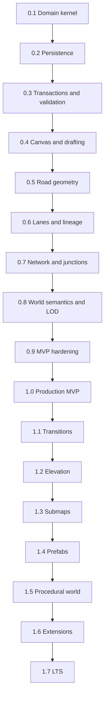

# Parametric World Cartography Editor Implementation Roadmap

## Document purpose

This roadmap converts the canonical **Parametric World Cartography Editor Master Design Specification Revision 2.0** into an implementation sequence that a human team or agentic coding system can execute without violating the source model. It defines what base functionality ships in each version, why that order exists, what must remain out of scope, which specification requirements first become enforceable, and what evidence is required before promotion.

This is a delivery plan, not a replacement architecture. If this roadmap and the canonical specification appear to disagree, the specification wins. If implementing a roadmap item would redefine a canonical term, move authoritative ownership, weaken a CORE requirement, or change a persisted contract, stop and create an Architecture Decision Record before changing code.

## Outcome first

The recommended release train is:

| Version | Release | User-visible milestone |
|---|---|---|
| v0.1.0 | Domain Kernel and Engineering Contract | A headless executable or library can create an empty Project and Map, create stable typed records in real-world units, validate basic ownership, and emit deterministic normalized state. |
| v0.2.0 | Project Package Persistence and Recovery | A user can create, open, save, autosave, recover, inspect, and migrate a canonical project package without losing unknown extension data. |
| v0.3.0 | Command Transactions Dependencies and Validation | Generic object and property edits can be previewed, committed, cancelled, undone, redone, persisted, and rebuilt without allowing background work to corrupt authoritative state. |
| v0.4.0 | Canvas Drafting and Generic Object Editing | A user can navigate an infinite real-scale canvas, create and edit generic geometry, organize it into layers and levels, calibrate references, inspect objects, and complete the primary shell workflows by keyboard. |
| v0.5.0 | RoadSpline Stationing and Derived Geometry | A user can draw, edit, reverse, measure, split, and merge road corridors while anchors remap deterministically and derived envelopes remain disposable and reproducible. |
| v0.6.0 | Lane Native Cross Sections and Stable Lineage | A user can author physically scaled lanes, medians, shoulders, sidewalks, and custom elements; reorder or edit them without breaking IDs; and inspect derived lane geometry and ports. |
| v0.7.0 | Transport Network and Basic Junctions | A user can connect compatible road endpoints and T-junction approaches, inspect the lane graph, define simple turn movements, and keep grade-ambiguous crossings separate. |
| v0.8.0 | World Semantics Styles and Semantic Zoom | A user can author buildings, zones, POIs, parcels, corridors, metadata, schemas, styles, labels, and scale-dependent representations around the lane-native road network. |
| v0.9.0 | MVP Integration Export and Hardening | Representative users can create a real-scale lane-native map from an empty project, validate it, recover it, and export PNG, SVG, and canonical JSON without internal tooling. |
| v1.0.0 | Production MVP | A production user can reliably author and export a game-agnostic, real-scale, lane-native two-dimensional world map with basic junction topology. |
| v1.1.0 | RoadTransitions and Advanced Junction Editing | A user can build physically coherent lane topology changes and advanced junction approaches without duplicating state between adjacent RoadSegments. |
| v1.2.0 | Elevation Bridges and Tunnels | A user can author grades, vertical curves, bridges, tunnels, stacked roads, clearance envelopes, and active-level views without accidental connections at crossings. |
| v1.3.0 | Hierarchical Maps Submaps and Portals | A user can create parking garages, interiors, facilities, and other detailed child Maps, connect them through paired PortalLinks, and navigate them even when child data is unloaded. |
| v1.4.0 | Versioned Parametric Prefabs | A user can publish, place, configure, update, compare, override, and detach prefab instances without hidden mutation of existing work. |
| v1.5.0 | Road Adjacent and Procedural World Systems | A user can derive large amounts of editable world structure from stable host bindings and persisted rules without turning generated output into fragile hidden state. |
| v1.6.0 | Extensions Advanced Export and Analysis | Teams can add importers, exporters, validators, schema types, styles, and tools while core projects remain readable and protected when extensions are missing. |
| v1.7.0 | Production Scale and Long Term Support | Large, nested, procedural projects remain responsive, diagnosable, recoverable, and compatible under sustained production use. |


The architecture is deliberately established before the specialized editor. Persistence precedes road authoring; transactions, validation, and dependency tracking precede complex mutations; lane identity precedes connectivity; explicit connectivity precedes transitions, elevation, portals, prefabs, and procedural systems. This order prevents later features from forcing destructive rewrites of identity, undo, migration, or ownership.

## Versioning policy

- **0.x releases are testable vertical development releases.** They may change internal APIs, but every persisted schema change still requires a migration and recovery path. Each 0.x release must be usable enough to exercise its capability through a supported interface, even if that interface is initially headless.
- **v0.9.0 is feature freeze for the MVP.** Only integration, performance, accessibility, security, documentation, and defect work enters after the freeze.
- **v1.0.0 is stabilization-only.** No new source object family or partially finished 1.1 feature may enter the production MVP.
- **v1.1 through v1.7 are backward-compatible capability releases.** A user can decline a new feature and keep existing project meaning. Migrations must not invent new authored intent.
- **Patch releases contain fixes, diagnostics, safe performance improvements, and documentation.** They do not add persisted feature scope or silently change derived geometry.
- **v2.x is provisional.** It begins only when 1.x is stable and a major API or schema boundary is justified. Future capability labels are planning hypotheses, not permission to bypass ADRs.
- The application version, project schema version, geometry-engine version, plugin API version, and exporter version are distinct. Never use the marketing version as a substitute for those compatibility dimensions.

## Release dependency map



Do not parallelize across a dependency arrow unless the upstream contract is already merged, versioned, and covered by contract tests. Parallel work inside a version is allowed only when packets do not edit the same persisted contract or authoritative ownership rule.

## Non-negotiable engineering rules

1. **The canonical specification is the source of truth.** Every task cites affected section numbers, CORE requirement IDs, and acceptance criteria.
2. **Authoritative source and derived output remain separate.** Derived meshes, paths, polygons, render tiles, labels, analyses, and previews are rebuildable and cannot become accidental source.
3. **Every mutation is a command.** There is no UI-only, importer-only, plugin-only, repair-only, or debug-only bypass around preconditions, impact analysis, validation, transaction commit, undo, invalidation, and persistence.
4. **Stable identity is preserved.** Array position, render order, selection order, or display name never becomes durable identity.
5. **Persistence is treated as a product feature.** Every new record or field defines versioning, defaults, unknown-data behavior, migration, normalization, and round-trip tests before merge.
6. **Determinism is observable.** Identical normalized source, engine versions, policies, and feature flags produce equivalent normalized outputs and hashes.
7. **Invalid previews may exist; invalid commits may not.** Interactive tools show violations and available resolutions before commit.
8. **Accessibility ships with each workflow.** Keyboard reachability, focus, accessible names, contrast, scaling, and non-color cues are acceptance work, not final polish.
9. **Performance never changes meaning.** Lower display detail is allowed; lower semantic precision, hidden omissions, or source corruption are not.
10. **Game-specific meaning stays outside the core.** Schemas, metadata, styles, libraries, exporters, and adapters express project-specific gameplay concepts.

## Required preflight decisions

Before v0.1.0 implementation begins, record the following decisions. If an existing repository already establishes one, document and validate it rather than replacing it casually.

| Decision | Must establish | Revisit trigger |
|---|---|---|
| Desktop application architecture | Supported platforms, UI shell, process model, renderer, accessibility surface | Platform support or isolation requirements change |
| Core implementation language | Numeric behavior, concurrency model, FFI boundary, packaging | Demonstrated inability to meet reliability or performance targets |
| Geometry policy | Approved libraries, licenses, robustness strategy, deterministic versioning | Golden output changes or unsupported algorithms |
| Persistence implementation | Canonical package adapter, normalized text rules, atomic filesystem behavior | Package scale or compatibility evidence requires change |
| Test architecture | Unit, property, golden, transaction, integration, visual, performance, fuzz, accessibility | A defect class escapes an existing layer |
| Plugin isolation | Deferred design constraints and threat-model owner | Must be finalized before v1.6.0 |

Technology selection must not alter the canonical domain. For example, a renderer may use single-precision camera-relative buffers while the source remains double-precision meters; a database may be used internally while canonical package import/export remains available.

## Common definition of ready for an agent task

A work packet is ready only when it includes:

- one release and one stable packet ID;
- objective and user-visible outcome;
- specification sections, CORE requirement IDs, and acceptance criteria;
- prerequisites and exact interfaces it may change;
- authoritative records affected and derived products invalidated;
- persistence and migration consequences;
- explicit non-goals;
- required tests and fixtures;
- performance, security, and accessibility impact;
- stop conditions that require an ADR or user decision.

## Common definition of done

A work packet is done only when:

- implemented behavior matches its requirement IDs and does not weaken prior requirements;
- source ownership and derived ownership are documented in code and schema;
- preview, commit, cancel, undo, redo, save-load, migration, and failure behavior are covered where applicable;
- diagnostics use stable rule IDs and repairs run through commands;
- stale background results cannot mutate current state;
- deterministic normalized output and golden fixtures are updated through the reviewed process;
- keyboard, focus, accessible name, contrast, and scaling behavior are tested for new UI;
- performance is measured when the change touches hot paths;
- export capability declarations and user documentation are updated;
- no unrelated refactor or speculative future feature is bundled into the packet.


# Agentic execution protocol

## How an agent should work on one packet

1. Read the canonical specification sections and every referenced requirement in full.
2. Inspect the repository, current schema version, architecture decisions, test fixtures, and the immediately preceding release gate.
3. Restate the packet as an implementation contract: allowed scope, non-goals, persisted effects, derived effects, tests, and stop conditions.
4. Produce a small change plan ordered from contracts and tests to domain behavior, adapters, UI, migration, and documentation.
5. Add or update failing tests before changing the implementation whenever the repository supports that workflow.
6. Implement the smallest complete vertical behavior. Do not add speculative generalized infrastructure without a current requirement.
7. Run focused tests after each layer, then the full affected suite, deterministic comparison, save-load round trip, and release gate tests.
8. Inspect user-visible output and diagnostics. Passing unit tests is insufficient for canvas, accessibility, export, and recovery work.
9. Report files changed, requirements satisfied, evidence produced, known limitations, and any decision that still needs an ADR.
10. Stop rather than guess when ownership, identity, migration, or destructive repair behavior is ambiguous.

## Mandatory stop conditions

An agent must pause and request a decision or author an ADR proposal when any of the following occurs:

- two normative requirements appear incompatible;
- the implementation would move authoritative ownership between object types;
- a persisted field must be removed, reinterpreted, or assigned a different unit;
- a stable ID would need replacement rather than remapping or lineage;
- a migration cannot preserve the last readable package;
- a geometry algorithm produces platform-dependent semantic results without a bounded policy;
- a plugin requires direct authoritative mutation or ambient filesystem/network/process authority;
- an export target cannot represent required semantics and no honest approximation contract exists;
- performance can be met only by dropping semantic precision or validation;
- a destructive command lacks deterministic dependent-object choices;
- the task requires a future release capability to make the current release work.

## Standard agent task template

Copy this block into an agentic coding tool and fill every field. Omit no field; use `none` explicitly when appropriate.

```yaml
task_id: R###-###
target_release: 0.0.0
title: concise imperative title
objective: one observable outcome
user_workflow: how a user or API caller reaches the behavior
specification:
  sections: []
  core_requirements: []
  acceptance_criteria: []
dependencies:
  packets: []
  contracts: []
authoritative_records:
  created_or_changed: []
  identity_rules: []
  ownership_rules: []
derived_products:
  generated_or_invalidated: []
persistence:
  schema_change: false
  migration: none
  unknown_data_behavior: preserve
commands:
  preview: required
  commit: atomic
  cancel: no mutation
  undo_redo: required
validation:
  preconditions: []
  diagnostics: []
tests:
  unit: []
  property: []
  golden: []
  transaction: []
  integration: []
  performance: []
  accessibility: []
  security: []
non_goals: []
stop_conditions: []
deliverables: []
```

## Agent response contract

Every completed packet should return:

```text
Result: completed | blocked | partial
Packet: R###-###
Requirements: IDs addressed
Behavior shipped: concise list
Persistence impact: schema and migration summary
Tests added: names and layers
Validation run: exact suites and outcomes
User-visible review: what was inspected
Known limitations: release-scoped limitations only
ADR or decision needed: none or exact question
```

# Release roadmap

## v0.1.0 Domain Kernel and Engineering Contract

**Release class:** Internal foundation  
**Primary goal:** Establish the technology-neutral domain kernel, repository boundaries, test harness, and governance rules that every later feature depends upon.  
**User-visible outcome:** A headless executable or library can create an empty Project and Map, create stable typed records in real-world units, validate basic ownership, and emit deterministic normalized state.

### Ship in this version

- Repository layout with explicit domain, application, infrastructure, presentation, and test boundaries.
- Canonical identifiers, immutable revision numbers, unit and angle value types, tolerance policy, result/error types, and deterministic comparison utilities.
- Project, Map, DisplayLayer, SpatialLevel, Group, Tag, and generic object envelopes with exactly-one-Map ownership.
- Source-versus-derived ownership annotations in code and schema documentation.
- Architecture Decision Record template, decision backlog, requirement-to-test tags, and automated checks for forbidden dependency directions.
- Continuous integration for build, unit tests, formatting, static analysis, dependency audit, and deterministic snapshot comparison.
- Fixture factories for empty, minimal, malformed, and forward-version projects.

### Explicit non-goals

- No interactive canvas, road geometry, persistence package, network, or export UI.
- No hard-coded game concepts or game-engine dependencies.
- No final choice of advanced import, collaboration, or three-dimensional technology.

### Required workstreams

#### Architecture

- Define dependency direction: presentation and adapters depend inward on application and domain; the domain depends on neither UI nor filesystem.
- Create module ownership rules and public interfaces before implementation packages grow.
- Record the selected language, UI shell, renderer, geometry library policy, serialization library, and supported desktop platforms in ADRs rather than embedding those choices in the domain model.

#### Domain

- Implement collision-resistant stable IDs and forbid collection index as identity.
- Implement meters as canonical storage with display-only unit conversion.
- Model Map ownership independently from SpatialLevel, DisplayLayer, groups, and tags.
- Introduce projectRevision and object revision metadata without using timestamps as semantic precedence.

#### Quality

- Build requirement-tagged test naming and machine-readable test reports.
- Add property tests for ID uniqueness, unit round trips, transform restrictions, and deterministic normalization.
- Start a golden-file approval process that records schema and generator versions.

### Release gates

- A minimal project produces byte-equivalent normalized output on repeated runs on supported platforms, except explicitly documented platform metadata.
- Ownership validation rejects missing, multiple, or cross-context owners.
- Unit conversion never changes stored canonical values.
- Every normative architectural rule implemented in this release has at least one requirement-tagged test.
- No domain package imports UI, filesystem, game-engine, or plugin implementation packages.

### First-enforced specification requirements

`ARCH-CORE-001`, `ARCH-CORE-007`, `ARCH-CORE-010`, `COORD-CORE-001`, `COORD-CORE-002`, `COORD-CORE-003`, `COORD-CORE-004`, `GOV-CORE-001`, `GOV-CORE-002`, `GOV-CORE-003`, `OWN-CORE-001`, `OWN-CORE-002`, `OWN-CORE-003`, `OWN-CORE-004`, `OWN-CORE-005`, `PROD-CORE-001`, `PROD-CORE-002`, `PROD-CORE-003`, `TEST-CORE-001`, `TEST-CORE-002`, `TEST-CORE-003`

### Acceptance criteria exercised

No numbered acceptance criterion first closes here; use the release-specific gates above.

### Agent work packets

| Packet | Work item | Objective | Depends on |
|---|---|---|---|
| `R010-001` | Repository and dependency skeleton | Create enforceable module boundaries, build targets, and CI. | None |
| `R010-002` | Identity units and tolerances | Implement stable IDs, canonical units, transforms, and named tolerance policy. | R010-001 |
| `R010-003` | Project ownership model | Implement Project, Map, level, layer, group, tag, and ownership invariants. | R010-002 |
| `R010-004` | Governance and traceability | Add ADRs, requirement tags, golden-file controls, and the decision backlog. | R010-001 |
| `R010-005` | Foundation conformance suite | Prove deterministic normalization and architectural boundary enforcement. | R010-002 through R010-004 |

### Version completion statement

v0.1.0 is complete only when every listed packet is merged, every gate is evidenced, all earlier release tests remain green, and the release can open and resave all retained compatibility fixtures without semantic drift.

## v0.2.0 Project Package Persistence and Recovery

**Release class:** Internal foundation  
**Primary goal:** Make authoritative source durable before complex editing exists, with migration, unknown-data preservation, atomic save, and recovery as first-class behavior.  
**User-visible outcome:** A user can create, open, save, autosave, recover, inspect, and migrate a canonical project package without losing unknown extension data.

### Ship in this version

- Canonical project package and manifest with format ID, schema version, project ID, units, feature flags, root maps, authoritative file hashes, and generator versions.
- Deterministic UTF-8 serialization with explicit type discriminators and stable ordering.
- Reference descriptors for required, optional, weak, and external references plus reverse-reference indexes.
- Atomic save using sibling staging, validation, flush, replace, and platform-specific fallback reporting.
- Autosave journal or authoritative checkpoint rotation, recovery chooser, and interrupted-save simulation.
- Transactional migration runner with backup, version guards, dry-run report, rollback behavior, and newer-schema read-only mode.
- Namespaced unknown-field and unknown-record round-trip preservation.
- Hostile input limits for sizes, nesting, counts, coordinates, paths, and allocation.

### Explicit non-goals

- No road-specific records beyond forward-compatible type registration stubs.
- No background cache system beyond disposable-cache metadata contracts.
- No cloud sync or collaborative history.

### Required workstreams

#### Package

- Implement package reader/writer behind interfaces so storage layout can evolve without entering the domain.
- Separate authoritative files, referenced assets, exports, and disposable caches.
- Normalize paths and reject traversal outside the project root.

#### Migration

- Make each migration one-way, version-addressed, deterministic, and idempotence-tested where feasible.
- Preserve the original package until the migrated package reopens and validates.
- Produce a human-readable and machine-readable migration report.

#### Recovery

- Simulate process termination at every save phase.
- Prove that restart yields either the prior valid package or the complete new package, never a mixed state.
- Test journal truncation, corrupt last record, disk-full, permission loss, and missing asset behavior.

### Release gates

- AC-012 Atomic save passes under injected interruption at every write phase.
- AC-013 Failed migration leaves the source readable and emits a useful report.
- AC-014 Unknown namespaced content survives load-save byte-equivalently where ordering permits.
- AC-017 Forced termination offers the latest consistent recovery state.
- Malformed input cannot mutate an already open project or write outside approved locations.
- Normalized save-load-save is semantically idempotent.

### First-enforced specification requirements

`DATA-CORE-001`, `DATA-CORE-002`, `DATA-CORE-003`, `DATA-CORE-004`, `FILE-CORE-001`, `FILE-CORE-002`, `FILE-CORE-003`, `FILE-CORE-004`, `FILE-CORE-005`, `SAFE-CORE-001`, `SAVE-CORE-001`, `SAVE-CORE-002`, `SAVE-CORE-003`, `SAVE-CORE-004`, `SAVE-CORE-005`

### Acceptance criteria exercised

`AC-012`, `AC-013`, `AC-014`, `AC-017`

### Agent work packets

| Packet | Work item | Objective | Depends on |
|---|---|---|---|
| `R020-001` | Canonical record envelopes | Define serialized envelopes, reference kinds, normalization, and extension preservation. | 0.1.0 |
| `R020-002` | Package reader and validator | Read manifests and authoritative files defensively into validated source records. | R020-001 |
| `R020-003` | Atomic writer and checkpoints | Implement staged save, checkpoint rotation, and recovery metadata. | R020-001 |
| `R020-004` | Migration framework | Add transactional migrations, backups, reports, and newer-version read-only mode. | R020-002 and R020-003 |
| `R020-005` | Fault-injection persistence suite | Exercise interruption, corruption, traversal, limits, and round-trip determinism. | R020-002 through R020-004 |

### Version completion statement

v0.2.0 is complete only when every listed packet is merged, every gate is evidenced, all earlier release tests remain green, and the release can open and resave all retained compatibility fixtures without semantic drift.

## v0.3.0 Command Transactions Dependencies and Validation

**Release class:** Internal foundation  
**Primary goal:** Ensure every future edit uses one deterministic command path with impact preview, undo, incremental validation, dependency invalidation, and stale-result protection.  
**User-visible outcome:** Generic object and property edits can be previewed, committed, cancelled, undone, redone, persisted, and rebuilt without allowing background work to corrupt authoritative state.

### Ship in this version

- Immutable project revisions and serialized command processor.
- Command contract with preconditions, expected revision, impact set, preview, source mutations, reference remaps, diagnostics, and invalidation records.
- Undo/redo transaction log that restores source state, IDs, references, and selection context.
- Continuous edit coalescing and cancel behavior.
- Explicit dependency graph with source hashes, station-range or spatial-region invalidation, and version-tagged background results.
- Incremental validator with Error, Warning, and Information severities and stable diagnostic rule IDs.
- Repair actions that preview and execute through the same command system.
- Generic destructive-impact dialog backed by reverse-reference analysis.

### Explicit non-goals

- No road-specific editing commands yet.
- No optimized multi-threaded scheduler; correctness and stale-result rejection come first.
- No plugin mutation boundary beyond an interface placeholder.

### Required workstreams

#### Transactions

- Commands never mutate live state during preview.
- Commit produces a new revision atomically or produces no revision.
- Undo and redo operate on authoritative deltas or durable inverse commands, not derived render state.

#### Dependencies

- Derived products declare complete source dependencies or an aggregate hash.
- Schedulers may run work concurrently but only the command processor may accept results.
- Obsolete results are discarded without observable source mutation.

#### Validation

- Precondition validation blocks structurally invalid commits.
- Post-commit validation is incremental and revision-tagged.
- Diagnostics contain rule ID, severity, affected IDs, message, revision, and zero or more repair commands.

### Release gates

- AC-015 proves a stale worker result cannot replace a newer cache.
- Random command sequences followed by full undo restore normalized source bytes and selection context.
- Cancelled previews produce no source, history, or cache mutation.
- A rebuild failure leaves source intact and attaches an Error diagnostic.
- Deletion of referenced objects cannot bypass explicit impact resolution.

### First-enforced specification requirements

`ARCH-CORE-008`, `ARCH-CORE-009`, `DEPS-CORE-001`, `DEPS-CORE-002`, `DEPS-CORE-003`, `DEPS-CORE-004`, `UNDO-CORE-001`, `UNDO-CORE-002`, `UNDO-CORE-003`, `UNDO-CORE-004`, `UNDO-CORE-005`, `UX-CORE-005`, `VAL-CORE-001`, `VAL-CORE-002`, `VAL-CORE-003`, `VAL-CORE-004`

### Acceptance criteria exercised

`AC-015`

### Agent work packets

| Packet | Work item | Objective | Depends on |
|---|---|---|---|
| `R030-001` | Command and revision protocol | Implement revision guards, preview, impact, commit, and cancellation. | 0.2.0 |
| `R030-002` | Undo redo journal | Restore source identity, references, and selection with coalescing. | R030-001 |
| `R030-003` | Dependency graph and scheduler | Track invalidations and safely accept or discard version-tagged results. | R030-001 |
| `R030-004` | Diagnostics and repairs | Implement stable diagnostics and command-backed repair previews. | R030-001 |
| `R030-005` | Transaction property tests | Test rollback, stale revisions, failure injection, undo, and rebuild isolation. | R030-002 through R030-004 |

### Version completion statement

v0.3.0 is complete only when every listed packet is merged, every gate is evidenced, all earlier release tests remain green, and the release can open and resave all retained compatibility fixtures without semantic drift.

## v0.4.0 Canvas Drafting and Generic Object Editing

**Release class:** First interactive alpha  
**Primary goal:** Deliver the primary two-dimensional workspace and interaction grammar before specialized road tools add complexity.  
**User-visible outcome:** A user can navigate an infinite real-scale canvas, create and edit generic geometry, organize it into layers and levels, calibrate references, inspect objects, and complete the primary shell workflows by keyboard.

### Ship in this version

- Infinite pan and zoom canvas with origin, meters, metric/imperial display, grid, rulers, measurement, coordinate readout, and fit/zoom commands.
- Camera-relative rendering that preserves double-precision source coordinates at large extents.
- Snapping and constraints for grid, endpoints, midpoints, tangents, perpendiculars, angles, distances, and configurable candidate priority.
- Generic point, polyline, polygon, rectangle, circle, text, reference image, and guide objects.
- Reference image placement, opacity, locking, calibration, transform preview, and non-authoritative status.
- Selection, box/lasso selection, overlap cycling, breadcrumbs, inspector, hierarchy, layer and level controls, visibility, locking, and search by ID/name/type/tag.
- Explicit hit-test precedence and minimum representation requests for active tools.
- Keyboard navigation, command palette, focus visibility, accessible names, UI scaling, and non-color state cues from the beginning.

### Explicit non-goals

- No lane-native road authoring.
- No automatic GIS interpretation of reference images.
- No elevation profile or child Map navigation.

### Required workstreams

#### Rendering

- Keep camera transforms and tessellation derived; never overwrite world coordinates with pixels.
- Use stable object IDs through selection, hover, rendering, and accessibility trees.
- Separate interaction overlays from export styles.

#### Interaction

- All tools implement enter, preview, commit, cancel, undo, redo, and focus-loss behavior.
- Locked objects may snap but cannot become editable primary selection.
- Hidden objects do not hit-test or snap unless the active tool explicitly requests them.

#### Accessibility

- Define keyboard equivalents concurrently with each command.
- Expose canvas selection and tool state to the platform accessibility API.
- Run contrast and scaling checks in CI for supplied themes and critical overlays.

### Release gates

- Every generic create/edit workflow passes preview, commit, cancel, undo, redo, save-load, and selection-restoration tests.
- Overlapping selectable objects can all be reached deterministically.
- Changing zoom or display units cannot mutate stored geometry.
- Reference recalibration previews affected traced objects and never silently transforms them.
- The interactive alpha is keyboard-operable for every functionality shipped in this release.

### First-enforced specification requirements

`A11Y-CORE-001`, `A11Y-CORE-002`, `DRAFT-CORE-001`, `DRAFT-CORE-002`, `UX-CORE-001`, `UX-CORE-002`, `UX-CORE-003`, `UX-CORE-004`

### Acceptance criteria exercised

No numbered acceptance criterion first closes here; use the release-specific gates above.

### Agent work packets

| Packet | Work item | Objective | Depends on |
|---|---|---|---|
| `R040-001` | Canvas camera and render layers | Implement real-scale navigation, camera-relative draw coordinates, grid, rulers, and overlays. | 0.3.0 |
| `R040-002` | Snapping and constraints | Implement named tolerance-based candidate acquisition and constraint solving. | R040-001 |
| `R040-003` | Generic geometry tools | Create and edit point, path, polygon, text, guides, and references through commands. | R040-001 and R040-002 |
| `R040-004` | Selection hierarchy and inspector | Implement precedence, overlap cycling, hierarchy, search, layers, levels, locking, and visibility. | R040-001 |
| `R040-005` | Interactive accessibility suite | Validate keyboard, focus, names, scaling, contrast, and non-color cues. | R040-003 and R040-004 |

### Version completion statement

v0.4.0 is complete only when every listed packet is merged, every gate is evidenced, all earlier release tests remain green, and the release can open and resave all retained compatibility fixtures without semantic drift.

## v0.5.0 RoadSpline Stationing and Derived Geometry

**Release class:** Road alpha  
**Primary goal:** Implement the authoritative road centerline and stable semantic stationing model before lane topology and network connectivity.  
**User-visible outcome:** A user can draw, edit, reverse, measure, split, and merge road corridors while anchors remap deterministically and derived envelopes remain disposable and reproducible.

### Ship in this version

- Open RoadSpline using polyline, Bezier, and fixed-radius primitives with stable primitive and control-point IDs.
- Canonical Start-to-End orientation, two-dimensional plan arc-length stationing, sampled frames, and analytic or tolerance-bounded evaluation.
- StationAnchor with last station, normalized fallback, stable primitive affinity, local parameter, last world position, and edit affinity modes.
- Anchor remap preview and explicit resolution for ambiguous or out-of-domain edits.
- Automatic one-segment full-domain creation for every new RoadSpline.
- RoadSegment half-open interval coverage, split, boundary move, equivalence-checked merge, and lineage.
- Initial uniform road cross-section placeholder sufficient to derive a road envelope.
- Offset diagnostics for cusp, tight radius, self-intersection, miter limit, and bounded invalid preview.
- Compound RoadSpline reverse command that remaps stations, directional fields, left/right groups, and future-compatible reference hooks.

### Explicit non-goals

- No lane-level network or automatic intersections.
- No topological lane transitions.
- No elevation profile; station remains plan distance by design.

### Required workstreams

#### Geometry

- Create a geometry-engine interface with explicit algorithm and tolerance version in derived hashes.
- Retain analytic source primitives; tessellation is view- and export-specific derived data.
- Produce deterministic envelope joins and diagnostics for failure cases.

#### Stationing

- Never serialize raw array indices or raw curve parameters as semantic locations.
- Remap anchors inside the same transaction as the geometry edit.
- Require Move, Delete dependent, or Cancel when committed shortening invalidates an anchor.

#### Segmentation

- Maintain complete ordered coverage with no gaps or overlaps.
- Record parent/predecessor/successor lineage during split and merge.
- Invalidate only affected station ranges and dependent products.

### Release gates

- AC-001 New RoadSpline creates exactly one valid full-domain RoadSegment and derived envelope.
- AC-003 Geometry-locked anchors remap deterministically and ambiguities are previewed.
- Road reversal twice returns equivalent normalized geometry and stable object identity for implemented fields.
- Property tests cover split/merge coverage, station monotonicity, endpoint tolerances, and edit-remap invariants.
- Invalid offsets block commit of required derived output but preserve a bounded preview and source edit choice.

### First-enforced specification requirements

`ARCH-CORE-002`, `ARCH-CORE-003`, `ARCH-CORE-004`, `GEOM-CORE-001`, `GEOM-CORE-002`, `GEOM-CORE-003`, `GEOM-CORE-004`, `GEOM-CORE-005`, `MAP-CORE-001`, `ROAD-CORE-001`, `ROAD-CORE-002`, `ROAD-CORE-003`, `SEGM-CORE-001`, `SEGM-CORE-002`, `SEGM-CORE-003`, `SEGM-CORE-004`, `SEGM-CORE-005`, `STAT-CORE-001`, `STAT-CORE-002`, `STAT-CORE-003`, `STAT-CORE-004`, `STAT-CORE-005`

### Acceptance criteria exercised

`AC-001`, `AC-003`

### Agent work packets

| Packet | Work item | Objective | Depends on |
|---|---|---|---|
| `R050-001` | Curve primitives and station evaluator | Implement analytic source curves, plan length, frames, and deterministic sampling. | 0.4.0 |
| `R050-002` | StationAnchor remapping | Implement affinities, signatures, remap preview, and ambiguity resolution. | R050-001 |
| `R050-003` | RoadSpline commands | Create, edit, reverse, extend, shorten, and delete roads through transactions. | R050-001 and R050-002 |
| `R050-004` | RoadSegment coverage | Implement full-domain creation, split, boundary move, merge, and lineage. | R050-003 |
| `R050-005` | Derived envelope engine | Generate deterministic road envelopes with failure diagnostics and range invalidation. | R050-001 and R050-004 |
| `R050-006` | Road geometry conformance suite | Add golden geometry and property-based station/edit tests. | R050-002 through R050-005 |

### Version completion statement

v0.5.0 is complete only when every listed packet is merged, every gate is evidenced, all earlier release tests remain green, and the release can open and resave all retained compatibility fixtures without semantic drift.

## v0.6.0 Lane Native Cross Sections and Stable Lineage

**Release class:** Lane alpha  
**Primary goal:** Replace placeholder road width with the canonical lane-native cross-section model while preserving identity through editing.  
**User-visible outcome:** A user can author physically scaled lanes, medians, shoulders, sidewalks, and custom elements; reorder or edit them without breaking IDs; and inspect derived lane geometry and ports.

### Ship in this version

- CrossSectionElement with stable ID, project type, Left/Center/Right group, order key, non-negative width profile, independent travel direction, connectivity role, style, metadata, and lineage.
- Project templates for travel lanes, shoulders, medians, sidewalks, buffers, barriers, and custom types without hard-coding gameplay semantics.
- Constant core widths and non-topological variable width profiles.
- Deterministic cumulative offsets, lane centerlines, lane boundaries, road envelope, and basic markings.
- Lane input/output ports with stable IDs and direction-aware geometry.
- Lane add, delete, duplicate, reorder, group move, type conversion, direction change, and width editing with impact previews.
- Explicit lane lineage for continuation, fork, split, merge, absorption, and dormancy.
- Cross-section editor synchronized with the map and context-sensitive inspector.
- Complete reverse command handling for left/right placement, travel direction, ports, and references.

### Explicit non-goals

- No topological change along an interval; lane add/drop tapers wait for v1.1 RoadTransition.
- No global lane graph traversal or junction movements.
- No traffic behavior or simulation.

### Required workstreams

#### Source model

- Array position is never identity and must not appear in durable references.
- Core segment lanes require positive width; zero width is reserved for dormant or transition states.
- Left/right placement remains independent from travel direction.

#### Editing

- Reorder changes order keys and derived offsets without changing IDs.
- Delete or conversion of referenced lane ports requires Retarget, Delete dependents, Disconnect, or Cancel.
- Split creates downstream IDs linked by lineage while preserving upstream IDs by rule.

#### Geometry

- Derive lane geometry from RoadSpline frames plus ordered width profiles.
- Use one deterministic offset policy for canvas, hit testing, validation, and export.
- Attach derivation hashes to cached geometry.

### Release gates

- AC-002 Split then undo restores geometry, metadata, lane lineage, references, and exact prior normalized state.
- AC-004 Reverse twice returns an equivalent project with stable IDs and connectivity hooks.
- AC-005 Lane reorder changes offsets but not IDs or compatible references.
- Every lane mutation passes save-load, undo-redo, deterministic rebuild, and destructive-impact tests.
- Real-scale measurements agree across source, derived geometry, hit testing, and exported canonical JSON.

### First-enforced specification requirements

`LANE-CORE-001`, `LANE-CORE-002`, `XSEC-CORE-001`, `XSEC-CORE-002`, `XSEC-CORE-003`, `XSEC-CORE-004`

### Acceptance criteria exercised

`AC-002`, `AC-004`, `AC-005`

### Agent work packets

| Packet | Work item | Objective | Depends on |
|---|---|---|---|
| `R060-001` | Cross-section source schema | Implement element types, groups, ordering, widths, directions, roles, and lineage. | 0.5.0 |
| `R060-002` | Lane geometry derivation | Generate offsets, centerlines, boundaries, envelopes, and markings. | R060-001 |
| `R060-003` | Lane ports and identity | Expose stable directed ports independent of lane indices. | R060-001 and R060-002 |
| `R060-004` | Cross-section commands | Implement lane and element edits with reference impact and undo. | R060-001 through R060-003 |
| `R060-005` | Cross-section editor | Build synchronized map/context editing and keyboard workflows. | R060-004 |
| `R060-006` | Lane lineage conformance suite | Test reorder, split, merge, reverse, delete, conversion, and round trips. | R060-003 through R060-005 |

### Version completion statement

v0.6.0 is complete only when every listed packet is merged, every gate is evidenced, all earlier release tests remain green, and the release can open and resave all retained compatibility fixtures without semantic drift.

## v0.7.0 Transport Network and Basic Junctions

**Release class:** Network alpha  
**Primary goal:** Connect lane semantics explicitly without inferring topology from visual overlap.  
**User-visible outcome:** A user can connect compatible road endpoints and T-junction approaches, inspect the lane graph, define simple turn movements, and keep grade-ambiguous crossings separate.

### Ship in this version

- Explicit ConnectionNode, LaneConnection, and Junction records with source ownership and stable endpoints.
- Compatibility candidate engine comparing Map, level, elevation metadata when available, position, tangent, width, direction, and lane role.
- Endpoint-to-endpoint connection workflow with deterministic default lane mapping and confirmation for ambiguity.
- Side-road T-junction workflow using explicit host anchors and approach clip boundaries without splitting the host RoadSpline.
- Junction approaches, lane-port movements, basic corner parameters, fill geometry, and simple movement editor.
- Collapsed road-level graph with local lane expansion and diagnostics-first network inspector.
- Disconnected crossing behavior for XY overlaps unless a connection command creates explicit topology.
- Reachability, orphan port, direction mismatch, duplicate connection, and ambiguous mapping validation.

### Explicit non-goals

- No advanced merge/diverge RoadTransitions.
- No conflict groups, traffic controls, signal timing, or route simulation.
- No full numeric elevation profile; grade separation is explicit metadata until v1.2.

### Required workstreams

#### Network model

- Physical geometry and semantic connectivity remain separate but cross-referenced.
- Every committed connection is an explicit network object.
- LaneConnection endpoints reference port IDs, never lane indices.

#### Junctions

- Approach clipping is derived from authoritative approach and clip-anchor records.
- Movements list entry and exit lane ports plus direction and optional control metadata.
- Manual corner edits occur through junction parameters rather than direct derived-polygon edits.

#### UX

- Connection preview shows orientation, host station, lane mapping, and reasons for incompatibility.
- Graph view is secondary to the map and opens lane detail only for the selected neighborhood.
- Disconnect and retarget actions always show dependent movements and routes.

### Release gates

- AC-007 Side-road connection creates host anchors, approaches, Junction, and movements in one undoable transaction.
- Crossing roads remain disconnected until the user explicitly connects them.
- Ambiguous lane mapping cannot commit without user confirmation.
- Deleting or converting referenced ports requires explicit dependent resolution.
- Network save-load and undo-redo preserve explicit topology and stable endpoint identity.

### First-enforced specification requirements

`ARCH-CORE-006`, `JUNC-CORE-001`, `JUNC-CORE-002`, `JUNC-CORE-003`, `NET-CORE-001`, `NET-CORE-002`, `NET-CORE-003`

### Acceptance criteria exercised

`AC-007`

### Agent work packets

| Packet | Work item | Objective | Depends on |
|---|---|---|---|
| `R070-001` | Network source records | Implement nodes, lane connections, references, indexes, and validators. | 0.6.0 |
| `R070-002` | Connection candidate engine | Compare context, geometry, direction, and roles without inferring commits. | R070-001 |
| `R070-003` | Endpoint connection workflow | Preview and commit deterministic explicit connections. | R070-001 and R070-002 |
| `R070-004` | T-junction source and geometry | Implement host anchors, approaches, clipping, movements, and derived fill. | R070-001 through R070-003 |
| `R070-005` | Network inspector and graph | Provide collapsed graph, local lane expansion, and diagnostics. | R070-001 and R070-004 |
| `R070-006` | Network conformance suite | Test ambiguity, disconnection, remaps, deletion impact, reachability, and determinism. | R070-003 through R070-005 |

### Version completion statement

v0.7.0 is complete only when every listed packet is merged, every gate is evidenced, all earlier release tests remain green, and the release can open and resave all retained compatibility fixtures without semantic drift.

## v0.8.0 World Semantics Styles and Semantic Zoom

**Release class:** Feature-complete alpha  
**Primary goal:** Complete the game-agnostic world-authoring and presentation layer required for the MVP while keeping semantics customizable.  
**User-visible outcome:** A user can author buildings, zones, POIs, parcels, corridors, metadata, schemas, styles, labels, and scale-dependent representations around the lane-native road network.

### Ship in this version

- Buildings, footprints, blocks, parcels, zones, POIs, boundaries, water, vegetation, terrain regions, and generic corridor geometry.
- Game-agnostic project schema editor with stable type and field IDs, validation constraints, enums, defaults, units, and exporter mappings.
- Metadata inspector and bulk edit with impact analysis for schema changes.
- DisplayLayers, groups, tags, filter queries, saved searches, and indexed object lookup.
- Style cascade across project defaults, type, layer, object, state overlay, and export profile with documented precedence.
- Labels with independent priority, collision, scale visibility, and placement rules.
- Semantic zoom from simplified road centerline/corridor through road envelope to lane-level detail, without source mutation.
- LOD-aware hit testing that preserves selection identity and allows active tools to request minimum detail.
- Basic project templates for common map presentations without embedding game-specific classes.

### Explicit non-goals

- No road-hosted procedural generation yet.
- No versioned prefab library.
- No player-context submap switching.

### Required workstreams

#### Semantics

- Keep core POI, zone, and event-like records generic; game meaning lives in project-defined schemas and metadata.
- Schema display-name changes never alter stable IDs.
- Unknown plugin fields remain preserved even when unavailable for editing.

#### Presentation

- Selection, hover, warning, lock, and direction overlays are separate from export style.
- Style conflict resolution never depends on creation order.
- Labels use a separate collision and priority system rather than becoming geometry.

#### Semantic zoom

- LOD changes only representation and hit-test detail.
- Measurements and selected object identity remain constant across zoom thresholds.
- Visual regression fixtures cover every threshold and supplied theme.

### Release gates

- AC-009 Zoom-level changes preserve coordinates, measurements, semantic identity, and selection.
- Schema rename preserves data and references; destructive schema edits require impact resolution.
- Style results are deterministic under record reordering.
- World objects complete create/edit/delete/undo/save-load and indexed-search workflows.
- No supplied schema or template introduces required game-engine or game-specific core types.

### First-enforced specification requirements

`LOD-CORE-001`, `LOD-CORE-002`, `LOD-CORE-003`, `SCHEMA-CORE-001`, `SCHEMA-CORE-002`, `SCHEMA-CORE-003`, `STYLE-CORE-001`, `STYLE-CORE-002`

### Acceptance criteria exercised

`AC-009`

### Agent work packets

| Packet | Work item | Objective | Depends on |
|---|---|---|---|
| `R080-001` | World object types | Implement generic buildings, regions, zones, POIs, parcels, and corridors. | 0.4.0 and 0.3.0 |
| `R080-002` | Project schemas | Implement stable custom types, fields, constraints, metadata, and change impact. | 0.2.0 and R080-001 |
| `R080-003` | Layers tags groups and search | Implement non-owning organization, filters, and indexes. | R080-001 |
| `R080-004` | Style and label engines | Implement deterministic cascade and scale-aware labels. | R080-001 through R080-003 |
| `R080-005` | Semantic zoom | Implement simplified-to-lane representations and LOD-aware hit testing. | 0.6.0 and R080-004 |
| `R080-006` | Presentation conformance suite | Test identity, measurements, style ordering, labels, contrast, and thresholds. | R080-004 and R080-005 |

### Version completion statement

v0.8.0 is complete only when every listed packet is merged, every gate is evidenced, all earlier release tests remain green, and the release can open and resave all retained compatibility fixtures without semantic drift.

## v0.9.0 MVP Integration Export and Hardening

**Release class:** Public beta candidate  
**Primary goal:** Freeze MVP scope, integrate the complete vertical workflow, meet published quality targets, and remove release-blocking reliability, accessibility, security, and performance defects.  
**User-visible outcome:** Representative users can create a real-scale lane-native map from an empty project, validate it, recover it, and export PNG, SVG, and canonical JSON without internal tooling.

### Ship in this version

- End-to-end new/open/edit/validate/save/recover/export workflows and onboarding templates.
- PNG, SVG, and canonical JSON exporters with explicit profiles, coordinate transforms, units, supported-semantics declarations, warnings, and manifests.
- Reference small, medium, and large datasets plus cold/warm-cache performance harness.
- Spatial, ID, reverse-reference, road interval, and network adjacency indexes.
- Chunked render/derived caches, range invalidation, cancellable workers, and graceful presentation-detail degradation.
- Security fuzzing for packages, paths, deep nesting, extreme coordinates, images, and extension data.
- Full keyboard workflow audit, accessible API inspection, WCAG 2.2 AA contrast validation, scaling, and high-density display testing.
- Crash reporting and telemetry controls with content redaction and opt-in behavior where required.
- User documentation, troubleshooting, diagnostic bundle, migration notes, and known-limitations register.

### Explicit non-goals

- No new source object family after feature freeze.
- No advanced RoadTransition, elevation, submaps, prefabs, procedural generation, or public plugin API.
- No performance optimization that changes semantic results.

### Required workstreams

#### Integration

- Run every primary workflow through persistence, transactions, rebuild, validation, selection, and export.
- Eliminate alternate mutation paths and debug-only required steps.
- Create compatibility fixtures for every schema version produced during 0.x development.

#### Performance

- Publish hardware, OS, dataset, feature flags, cache state, median, and 95th percentile for every target.
- Meet 60 FPS representative 10,000-object viewport, 50 ms feedback, 200 ms simple commit, 250 ms post-drag local rebuild, 5 s first interactive 100,000-object root Map with valid caches, 2 s incremental save for under 1,000 changed records, 200 ms ordinary undo, and 100 ms first indexed search result.
- Treat missed targets as measured release risks, never as permission to reduce source precision.

#### Release quality

- Zero known data-loss or silent semantic-omission defects.
- All fixed CORE defects add requirement-tagged regression tests.
- Golden updates require reviewed schema and geometry-engine version changes.

### Release gates

- AC-016 Export manifests identify revision, units, transform, profile, support level, and warnings.
- AC-018 Every MVP primary workflow is keyboard-completable with visible focus and accessible names.
- AC-019 Identical inputs and engine versions produce equivalent normalized source and derived export hashes.
- AC-020 Reference datasets meet published median and 95th-percentile targets or have an explicit approved release exception.
- All earlier MVP acceptance criteria remain green across supported platforms.
- No open Severity 1 defect, data-loss defect, migration corruption, path traversal, or silent export omission.

### First-enforced specification requirements

`A11Y-CORE-003`, `A11Y-CORE-004`, `A11Y-CORE-005`, `EXPT-CORE-001`, `EXPT-CORE-002`, `EXPT-CORE-003`, `PERF-CORE-001`, `PERF-CORE-002`, `SAFE-CORE-002`

### Acceptance criteria exercised

`AC-016`, `AC-018`, `AC-019`, `AC-020`

### Agent work packets

| Packet | Work item | Objective | Depends on |
|---|---|---|---|
| `R090-001` | Export profiles and manifests | Implement PNG, SVG, and canonical JSON export contracts. | 0.8.0 |
| `R090-002` | Reference datasets and benchmarks | Create deterministic scale fixtures and publish performance methodology. | 0.8.0 |
| `R090-003` | Indexes caches and scheduling | Meet scale targets without changing semantic precision. | R090-002 and 0.3.0 |
| `R090-004` | Security and fuzz campaign | Exercise untrusted inputs, limits, paths, and safe failure. | 0.2.0 through 0.8.0 |
| `R090-005` | Accessibility certification pass | Audit keyboard, focus, names, contrast, scaling, and assistive technology behavior. | 0.4.0 through 0.8.0 |
| `R090-006` | MVP workflow integration | Test complete authoring journeys and remove alternate mutation paths. | R090-001 through R090-005 |
| `R090-007` | Beta documentation and supportability | Ship guides, diagnostics, compatibility notes, and known limitations. | R090-006 |

### Version completion statement

v0.9.0 is complete only when every listed packet is merged, every gate is evidenced, all earlier release tests remain green, and the release can open and resave all retained compatibility fixtures without semantic drift.

## v1.0.0 Production MVP

**Release class:** First supported public release  
**Primary goal:** Promote the frozen MVP only after stabilization, compatibility, packaging, and support readiness are demonstrated.  
**User-visible outcome:** A production user can reliably author and export a game-agnostic, real-scale, lane-native two-dimensional world map with basic junction topology.

### Ship in this version

- All functionality accepted in v0.9.0 with no new source-model feature scope.
- Supported installer or distribution artifacts, clean-machine verification, signed release metadata where applicable, and rollback instructions.
- Schema compatibility promise for the 1.x line and documented migration policy.
- Public sample projects, keyboard reference, troubleshooting, data-recovery guide, and export capability matrix.
- Release notes separating fixed defects, known limitations, schema changes, and deferred capabilities.
- Long-lived v1.0 compatibility fixtures and an emergency patch process.

### Explicit non-goals

- No feature accepted merely because it is nearly complete.
- No experimental 1.1 capability enabled by default.
- No breaking schema or extension API commitment beyond what is explicitly published.

### Required workstreams

#### Release

- Run clean install, upgrade from every supported 0.x package, uninstall, rollback, and recovery tests.
- Reproduce release artifacts from a tagged source revision.
- Archive symbols, dependency manifests, schema fixtures, test reports, and export golden files.

#### Support

- Define Severity 1 through 4 and patch eligibility.
- Create a redacted diagnostic-bundle workflow.
- Document recovery before repair and never instruct users to overwrite the last readable package.

### Release gates

- All MVP-applicable acceptance criteria pass on every supported platform.
- A release candidate completes the soak period without unresolved data-loss, corruption, deterministic-output, or security regressions.
- Upgrade, save, reopen, export, and recovery work on every retained compatibility fixture.
- Performance and accessibility reports are published with the release record.
- The support and rollback procedure has been rehearsed from production-equivalent artifacts.

### First-enforced specification requirements

No new CORE requirement family begins here; this release promotes and re-verifies prior requirements.

### Acceptance criteria exercised

`AC-001`, `AC-002`, `AC-003`, `AC-004`, `AC-005`, `AC-007`, `AC-009`, `AC-012`, `AC-013`, `AC-014`, `AC-015`, `AC-016`, `AC-017`, `AC-018`, `AC-019`, `AC-020`

### Agent work packets

| Packet | Work item | Objective | Depends on |
|---|---|---|---|
| `R100-001` | Release candidate qualification | Run the complete conformance, compatibility, performance, security, and accessibility matrix. | 0.9.0 |
| `R100-002` | Distribution and clean-machine validation | Produce reproducible artifacts and verify install, upgrade, rollback, and uninstall. | R100-001 |
| `R100-003` | Documentation and support launch | Publish samples, recovery, compatibility, limitations, and support procedures. | R100-001 |
| `R100-004` | Production promotion | Tag, archive evidence, publish, and monitor without adding feature scope. | R100-002 and R100-003 |

### Version completion statement

v1.0.0 is complete only when every listed packet is merged, every gate is evidenced, all earlier release tests remain green, and the release can open and resave all retained compatibility fixtures without semantic drift.

## v1.1.0 RoadTransitions and Advanced Junction Editing

**Release class:** Backward-compatible feature release  
**Primary goal:** Introduce the exclusive source object for lane additions, drops, splits, merges, width morphs, and complex approach changes.  
**User-visible outcome:** A user can build physically coherent lane topology changes and advanced junction approaches without duplicating state between adjacent RoadSegments.

### Ship in this version

- RoadTransition source records with host bindings, station-aligned endpoints, input/output ports, explicit mappings, parameters, and ownership intervals.
- Transition families for lane add/drop, split/merge, reorder/crossover where valid, width morph, shoulder/median change, and multi-host merge/diverge.
- Exclusive interval ownership validation and prevention of overlapping change ownership.
- Transition length guidance, taper diagnostics, mapping editor, bounded preview, and insufficient-length error handling.
- Advanced Junction movement editing, approach reconciliation, complex lane mapping, conflict-group schema, and parameterized corner geometry.
- Transition-aware split, merge, reverse, delete, retarget, save-load, export, and repair behavior.

### Explicit non-goals

- No traffic simulation or signal timing engine.
- No direct editing of derived taper polygons.
- No elevation-specific transition geometry beyond forward-compatible hooks.

### Required workstreams

#### Model

- RoadSegments own stable endpoint states; RoadTransitions exclusively own changes between them.
- Transition endpoints align to StationAnchors and compatible segment states.
- Mappings explicitly cover every required input and output port.

#### Tools

- Provide intent-level commands such as Add lane, Drop lane, Split lane, Merge lanes, and Change median.
- Preview length, ownership, mappings, geometry, and dependent network changes before commit.
- Offer deterministic repair for moved boundaries and invalidated host intervals.

### Release gates

- AC-006 Lane Add transition exclusively owns the taper and exposes complete input/output mappings.
- No segment core independently encodes a topological change owned by a transition.
- Overlapping transition intervals are rejected with stable diagnostics.
- Transition commands pass undo, save-load, reverse, split/merge, and deterministic export tests.
- Legacy 1.0 projects open unchanged and receive transitions only through explicit user commands or migrations that preserve meaning.

### First-enforced specification requirements

`ARCH-CORE-005`, `TRAN-CORE-001`, `TRAN-CORE-002`, `TRAN-CORE-003`, `TRAN-CORE-004`

### Acceptance criteria exercised

`AC-006`

### Agent work packets

| Packet | Work item | Objective | Depends on |
|---|---|---|---|
| `R110-001` | Transition schema and invariants | Implement ownership, mappings, endpoint states, references, and validators. | 1.0.0 |
| `R110-002` | Transition geometry | Generate deterministic taper, merge, diverge, and morph geometry. | R110-001 |
| `R110-003` | Transition authoring tools | Implement intent-level creation, mapping, preview, repair, and deletion. | R110-001 and R110-002 |
| `R110-004` | Advanced junction movements | Integrate transition-aware approaches and movement editing. | R110-001 and 0.7.0 |
| `R110-005` | Transition conformance suite | Test exclusivity, completeness, boundary edits, reverse, undo, save-load, and export. | R110-002 through R110-004 |

### Version completion statement

v1.1.0 is complete only when every listed packet is merged, every gate is evidenced, all earlier release tests remain green, and the release can open and resave all retained compatibility fixtures without semantic drift.

## v1.2.0 Elevation Bridges and Tunnels

**Release class:** Backward-compatible feature release  
**Primary goal:** Add continuous numeric elevation and vertical design while preserving the distinction between elevation, SpatialLevel, DisplayLayer, and topology.  
**User-visible outcome:** A user can author grades, vertical curves, bridges, tunnels, stacked roads, clearance envelopes, and active-level views without accidental connections at crossings.

### Ship in this version

- RoadSpline elevation profile over plan station with linear grades and vertical-curve primitives.
- Continuous-Z validation, grade limits from project policy, discontinuity diagnostics, and three-dimensional travel-length analysis.
- Derived lane Z from host station, superelevation/cross-slope extension points, bridge/tunnel classifications, and clearance envelopes.
- Active SpatialLevel controls, ghost-above/below display, section/profile editor, and elevation-aware snapping.
- Explicit grade-separation and connection workflows for stacked crossings.
- Elevation-aware network candidate scoring, junction compatibility, validation, exports, and measurements.

### Explicit non-goals

- No authoritative photorealistic terrain or three-dimensional scene editing.
- No automatic civil-engineering compliance certification.
- No child Map switching; that arrives in v1.3.

### Required workstreams

#### Geometry

- Station remains two-dimensional plan arc length when elevation changes.
- Derived lane geometry inherits RoadSpline Z at matching station.
- Numeric elevation is stored relative to the owning Map datum in meters.

#### Semantics

- SpatialLevel never substitutes for numeric elevation.
- Different Z or levels do not imply a connection or disconnection object; connectivity remains explicit.
- Bridge and tunnel meaning is project-extensible metadata plus validated spatial behavior.

### Release gates

- AC-008 Roads crossing at different elevation remain disconnected until explicitly connected.
- Elevation-profile edits do not move plan-station anchors.
- Committed profiles are continuous in Z or use an explicit discontinuity object allowed by the model.
- Clearance diagnostics are deterministic and reference the affected objects and spatial interval.
- 1.0 and 1.1 projects without profiles reopen with unchanged two-dimensional semantics.

### First-enforced specification requirements

`ELEV-CORE-001`, `ELEV-CORE-002`, `ELEV-CORE-003`, `ELEV-CORE-004`, `ELEV-CORE-005`

### Acceptance criteria exercised

`AC-008`

### Agent work packets

| Packet | Work item | Objective | Depends on |
|---|---|---|---|
| `R120-001` | Elevation profile source model | Implement profile primitives, continuity, grades, and measurements over plan station. | 1.1.0 |
| `R120-002` | Three-dimensional derived geometry | Apply elevation to road and lane geometry while preserving plan station. | R120-001 |
| `R120-003` | Profile and active-level UI | Build profile editing, level controls, ghosting, and elevation snapping. | R120-001 and R120-002 |
| `R120-004` | Grade separation and clearance | Implement explicit stacked-crossing behavior and clearance validation. | R120-002 and 0.7.0 |
| `R120-005` | Elevation conformance suite | Test continuity, grades, station stability, crossings, levels, undo, persistence, and export. | R120-003 and R120-004 |

### Version completion statement

v1.2.0 is complete only when every listed packet is merged, every gate is evidenced, all earlier release tests remain green, and the release can open and resave all retained compatibility fixtures without semantic drift.

## v1.3.0 Hierarchical Maps Submaps and Portals

**Release class:** Backward-compatible feature release  
**Primary goal:** Support detailed nested spaces and context switching without allowing one source object to span coordinate contexts.  
**User-visible outcome:** A user can create parking garages, interiors, facilities, and other detailed child Maps, connect them through paired PortalLinks, and navigate them even when child data is unloaded.

### Ship in this version

- Parent-child Map hierarchy with translation, rotation, and uniform scale transforms, datum, defaults, independent files, and lazy loading.
- Child Map references and unloaded stubs that preserve identity, bounds, portal endpoints, and navigation summaries.
- Paired Portal endpoints and PortalLink with directionality, transform, lane/network mapping, display rules, and metadata.
- Single-Map RoadSpline enforcement and explicit per-Map splines for visually continuous cross-context roads.
- Map deletion impact choices for incoming portals: Retarget, Delete links, or Cancel.
- Player Context Preview for current Map, active SpatialLevel, ghosting, portal switching, route continuity, and breadcrumb navigation.
- Parking-garage reference workflow including floors, ramps, internal lanes, entrances, and parent/child mapping.

### Explicit non-goals

- No cross-Map object ownership or RoadSpline that spans Maps.
- No collaborative streaming service.
- No non-uniform scale or shear for navigable relationships.

### Required workstreams

#### Hierarchy

- Each child remains an independently serialized owning context.
- Hierarchy and loading do not transfer ownership.
- Detect circular parent relationships and invalid transforms before commit.

#### Portals

- PortalLink is the only cross-Map network relationship.
- Endpoint contracts include compatible position, tangent, width, direction, and lane mapping.
- Unloaded child references resolve through portal stubs rather than dangling IDs.

### Release gates

- AC-010 Parent-to-child route traverses paired portals and survives unloaded-child state.
- No RoadSpline can commit with geometry owned by more than one Map.
- Child Map transform rejects non-uniform scale, shear, and hierarchy cycles.
- Deleting or moving a Map cannot silently orphan incoming PortalLinks.
- Player Context Preview reports current Map, level, transform chain, and reachable portal route deterministically.

### First-enforced specification requirements

`MAP-CORE-002`, `MAP-CORE-003`, `MAP-CORE-004`, `NET-CORE-004`

### Acceptance criteria exercised

`AC-010`

### Agent work packets

| Packet | Work item | Objective | Depends on |
|---|---|---|---|
| `R130-001` | Map hierarchy and transforms | Implement parent references, valid transforms, independent serialization, and cycle detection. | 1.2.0 |
| `R130-002` | Lazy loading and stubs | Load child Maps on demand while retaining identity, bounds, and network summaries. | R130-001 and 0.2.0 |
| `R130-003` | Portal endpoints and links | Implement paired cross-Map connectivity and lane mappings. | R130-001 and R130-002 |
| `R130-004` | Context navigation and preview | Build breadcrumbs, switching, ghosting, and Player Context Preview. | R130-002 and R130-003 |
| `R130-005` | Submap conformance suite | Test transforms, unload/reload, routes, deletion impact, cycles, persistence, and export. | R130-003 and R130-004 |

### Version completion statement

v1.3.0 is complete only when every listed packet is merged, every gate is evidenced, all earlier release tests remain green, and the release can open and resave all retained compatibility fixtures without semantic drift.

## v1.4.0 Versioned Parametric Prefabs

**Release class:** Backward-compatible feature release  
**Primary goal:** Make reusable intersections, facilities, road assemblies, and map fragments predictable through immutable versions and explicit reconciliation.  
**User-visible outcome:** A user can publish, place, configure, update, compare, override, and detach prefab instances without hidden mutation of existing work.

### Ship in this version

- PrefabDefinition with immutable published versions, stable definition-object IDs, parameter schema, ports, constraints, and allowed host bindings.
- PrefabInstance bound to an explicit definition version with parameters, overrides, host bindings, and reconciliation state.
- Instance placement preview for geometry, ownership, ports, constraints, and conflicts.
- Deterministic update diff showing added, removed, modified, and conflicted source objects.
- Property-path overrides, orphan override diagnostics, preserve/adopt/reset choices, and explicit adapters for incompatible port contracts.
- Detach command that preserves current source geometry, connectivity, metadata, and independent ownership.
- Acyclic nested prefab support only if the dependency and reconciliation model is proven; otherwise retain a documented backlog item.

### Explicit non-goals

- No mutable published definition versions.
- No silent auto-update of existing instances.
- No cyclic prefab dependency graph.

### Required workstreams

#### Versioning

- Publishing a changed definition creates a new immutable version.
- Existing instances remain bound until the user requests an update.
- Definition object IDs and property paths provide stable override addresses.

#### Reconciliation

- Compute updates as a deterministic three-way comparison of old definition, new definition, and instance overrides.
- Never discard conflicts; surface them with affected objects and available resolution commands.
- Apply accepted changes as one undoable transaction.

### Release gates

- AC-011 Updating an instance previews a deterministic diff and preserves or reports every override.
- Old definition versions remain available while referenced.
- Detach preserves normalized source geometry and valid connectivity.
- A failed or cancelled reconciliation makes no source change.
- Missing prefab libraries permit safe inspection and diagnostics rather than corrupt partial materialization.

### First-enforced specification requirements

`PREF-CORE-001`, `PREF-CORE-002`, `PREF-CORE-003`, `PREF-CORE-004`, `PREF-CORE-005`, `PREF-CORE-006`

### Acceptance criteria exercised

`AC-011`

### Agent work packets

| Packet | Work item | Objective | Depends on |
|---|---|---|---|
| `R140-001` | Prefab definition and version store | Implement immutable versions, ports, parameters, constraints, and dependencies. | 1.3.0 |
| `R140-002` | Instance binding and placement | Instantiate source graphs with stable bindings and preview validation. | R140-001 |
| `R140-003` | Override model | Address overrides by stable definition IDs and property paths with orphan diagnostics. | R140-001 and R140-002 |
| `R140-004` | Reconciliation engine | Produce deterministic update diffs and command-backed resolutions. | R140-001 through R140-003 |
| `R140-005` | Detach and dependency handling | Preserve source and connectivity while removing the binding; enforce acyclicity. | R140-002 through R140-004 |
| `R140-006` | Prefab conformance suite | Test versions, updates, overrides, conflicts, detach, missing libraries, undo, and persistence. | R140-004 and R140-005 |

### Version completion statement

v1.4.0 is complete only when every listed packet is merged, every gate is evidenced, all earlier release tests remain green, and the release can open and resave all retained compatibility fixtures without semantic drift.

## v1.5.0 Road Adjacent and Procedural World Systems

**Release class:** Backward-compatible feature release  
**Primary goal:** Add deterministic, overrideable generation for road-adjacent buildings, blocks, parcels, vegetation, barriers, lights, and repeated corridor objects.  
**User-visible outcome:** A user can derive large amounts of editable world structure from stable host bindings and persisted rules without turning generated output into fragile hidden state.

### Ship in this version

- Road-adjacent placement rules with side, setback, interval, facing, spacing, exclusions, elevation behavior, and host StationAnchors.
- Block detection over an explicitly configured planar network projection with open-boundary diagnostics.
- Parcel subdivision rules with deterministic seeds, minimum dimensions, access constraints, and inspectable intermediate results.
- Spline-distributed objects for lights, trees, barriers, signs, markings, fences, and custom schema-driven assets.
- Deterministic generated IDs derived from rule ID and stable ordinal/key rather than render order.
- Per-instance override, exclusion, bake/detach, regenerate, and reset workflows.
- Incremental regeneration limited to affected host station or spatial ranges.

### Explicit non-goals

- No opaque one-click city generator.
- No render-order-dependent randomness.
- No manual mutation of generated instances without an override or detach decision.

### Required workstreams

#### Rules

- Persist every seed and all generation inputs.
- Generated instance identity remains stable when unaffected earlier ranges change.
- Host remapping follows the same StationAnchor and transaction policies as authored attachments.

#### Editing

- Make source rules, generated previews, overrides, and baked objects visually distinct.
- Preview regeneration impact before deleting or re-identifying generated instances.
- Retain user overrides or report conflicts during compatible rule changes.

### Release gates

- Identical rule inputs, seeds, and engine versions produce identical generated IDs and normalized output.
- Compatible road edits preserve hosted bindings and unaffected generated identities.
- Block detection reports open or non-planar ambiguity instead of inventing parcels.
- Manual edits require explicit override or detach and survive regeneration according to declared policy.
- Large regeneration cannot overwrite results for a newer source revision.

### First-enforced specification requirements

`PROC-CORE-001`, `PROC-CORE-002`, `PROC-CORE-003`, `URBN-CORE-001`, `URBN-CORE-002`

### Acceptance criteria exercised

`AC-015`, `AC-019`

### Agent work packets

| Packet | Work item | Objective | Depends on |
|---|---|---|---|
| `R150-001` | Hosted rule framework | Implement deterministic rule records, seeds, bindings, IDs, previews, and invalidation. | 1.4.0 |
| `R150-002` | Spline-distributed objects | Place repeated objects along stable station intervals with overrides and exclusions. | R150-001 |
| `R150-003` | Road-adjacent buildings | Generate footprints and instances from side, setback, spacing, and host rules. | R150-001 |
| `R150-004` | Blocks and parcels | Detect planar blocks and apply deterministic subdivision with diagnostics. | R150-001 and 0.7.0 |
| `R150-005` | Procedural editing UX | Implement regenerate, override, exclude, bake, detach, and conflict previews. | R150-002 through R150-004 |
| `R150-006` | Procedural conformance suite | Test seeds, stable IDs, host edits, overrides, invalidation, undo, persistence, and export. | R150-005 |

### Version completion statement

v1.5.0 is complete only when every listed packet is merged, every gate is evidenced, all earlier release tests remain green, and the release can open and resave all retained compatibility fixtures without semantic drift.

## v1.6.0 Extensions Advanced Export and Analysis

**Release class:** Version One capability completion  
**Primary goal:** Expose a safe versioned extension boundary and complete advanced search, validation, analysis, styling, and exporter capabilities without transferring authority to plugins.  
**User-visible outcome:** Teams can add importers, exporters, validators, schema types, styles, and tools while core projects remain readable and protected when extensions are missing.

### Ship in this version

- Versioned plugin manifest with ID, version, compatible API range, capabilities, permissions, namespaces, and dependency declarations.
- Isolated plugin execution policy with explicit filesystem, network, process, and project-data permissions.
- Validated command boundary for all plugin-proposed mutations; no direct authoritative writes.
- Safe missing-plugin mode that preserves namespaced records and permits unaffected read-only access.
- Exporter SDK with support/approximation/omission declarations and conformance fixtures.
- Additional core PDF, CSV, and GeoJSON-style exports where semantics can be represented honestly.
- Advanced validation rules, analysis overlays, query/search language, style tools, and batch operations.
- Extension diagnostics, version capture, crash containment, and compatibility reporting.

### Explicit non-goals

- No unrestricted in-process arbitrary code with ambient authority.
- No plugin-defined core ownership semantics.
- No silent omission of unsupported required semantics.

### Required workstreams

#### Security

- Choose the isolation mechanism by ADR after threat modeling supported platforms.
- Default deny sensitive capabilities and require user-visible grants.
- Treat plugin payloads and outputs as untrusted input.

#### API

- Stabilize data-transfer objects separately from internal domain implementation.
- Version capabilities and keep backward-compatible negotiation within 1.x.
- Require extensions to declare semantic support for each importer/exporter profile.

### Release gates

- A malicious or defective test plugin cannot directly mutate authoritative state, escape approved paths, or conceal a failed operation.
- Removing a plugin preserves its unknown data and leaves unaffected core content readable.
- Exporter conformance rejects silent omission of required semantics.
- Plugin command proposals receive the same validation, preview, undo, and audit behavior as core commands.
- API compatibility tests cover the minimum and maximum declared supported versions.

### First-enforced specification requirements

`PLUG-CORE-001`, `PLUG-CORE-002`, `PLUG-CORE-003`

### Acceptance criteria exercised

`AC-014`, `AC-016`, `AC-019`

### Agent work packets

| Packet | Work item | Objective | Depends on |
|---|---|---|---|
| `R160-001` | Extension threat model and ADR | Choose isolation, permissions, signing/trust, failure, and update policies. | 1.5.0 |
| `R160-002` | Plugin manifest and loader | Validate identities, versions, capabilities, permissions, namespaces, and dependencies. | R160-001 |
| `R160-003` | Command and data boundary | Expose DTOs and route all mutations through validated commands. | R160-001 and R160-002 |
| `R160-004` | Exporter and validator SDK | Provide versioned extension points, capability declarations, fixtures, and diagnostics. | R160-003 |
| `R160-005` | Missing and hostile plugin behavior | Preserve data, contain failures, enforce permissions, and verify read-only access. | R160-002 through R160-004 |
| `R160-006` | Advanced built-in tools | Ship advanced queries, analysis, validation, styles, and truthful additional exports. | R160-004 |

### Version completion statement

v1.6.0 is complete only when every listed packet is merged, every gate is evidenced, all earlier release tests remain green, and the release can open and resave all retained compatibility fixtures without semantic drift.

## v1.7.0 Production Scale and Long Term Support

**Release class:** Mature 1.x release  
**Primary goal:** Consolidate the complete Version One feature set at large-world scale and establish a stable long-term support baseline before any 2.0 API expansion.  
**User-visible outcome:** Large, nested, procedural projects remain responsive, diagnosable, recoverable, and compatible under sustained production use.

### Ship in this version

- Profiling and optimization across maps, transitions, elevation, portals, prefabs, procedural rules, validation, search, and export.
- Lazy Map and asset loading, bounded memory policies, background prioritization, cancellation, and cache observability.
- Project health dashboard for package integrity, unresolved references, validation totals, stale caches, extension status, and performance hotspots.
- Compatibility and migration matrix for every 1.x schema and supported plugin API range.
- Long-running soak, fuzz, deterministic replay, repeated migration, and recovery campaigns.
- Documentation consolidation and LTS patch policy.

### Explicit non-goals

- No new authoritative object family.
- No 2.0 experimental API enabled in production projects.
- No optimization that weakens validation, precision, determinism, or recovery.

### Required workstreams

#### Scale

- Profile before optimizing and retain representative traces with the benchmark results.
- Prioritize visible and dependency-critical work without allowing stale completion to win.
- Bound memory and queue growth under rapid edits and map switching.

#### Compatibility

- Retain golden projects for every 1.x minor version.
- Test sequential and direct-to-latest migrations.
- Keep plugin compatibility and project schema compatibility as separate matrices.

### Release gates

- All AC-001 through AC-020 pass for their implemented capabilities.
- Large reference projects meet published median and 95th-percentile targets with bounded memory.
- Repeated edit/save/reopen/migrate cycles produce no reference drift, identity loss, or nondeterministic output.
- All supported 1.x projects and plugins have an automated compatibility result.
- No unresolved Severity 1 or systemic Severity 2 reliability defect remains.

### First-enforced specification requirements

No new CORE requirement family begins here; this release promotes and re-verifies prior requirements.

### Acceptance criteria exercised

`AC-001`, `AC-002`, `AC-003`, `AC-004`, `AC-005`, `AC-006`, `AC-007`, `AC-008`, `AC-009`, `AC-010`, `AC-011`, `AC-012`, `AC-013`, `AC-014`, `AC-015`, `AC-016`, `AC-017`, `AC-018`, `AC-019`, `AC-020`

### Agent work packets

| Packet | Work item | Objective | Depends on |
|---|---|---|---|
| `R170-001` | Whole-product profiling | Measure complete workflows on representative nested and procedural projects. | 1.6.0 |
| `R170-002` | Loading memory and scheduling | Bound resource use and prioritize visible, critical, and user-blocking work. | R170-001 |
| `R170-003` | Project health dashboard | Expose integrity, references, validation, caches, plugins, and hotspots. | R170-001 |
| `R170-004` | Compatibility campaign | Exercise every schema, migration path, plugin API range, and export fixture. | 1.6.0 |
| `R170-005` | LTS qualification | Run soak, fuzz, deterministic replay, recovery, accessibility, and performance gates. | R170-002 through R170-004 |

### Version completion statement

v1.7.0 is complete only when every listed packet is merged, every gate is evidenced, all earlier release tests remain green, and the release can open and resave all retained compatibility fixtures without semantic drift.


# Cross-release quality system

## Test pyramid required from the first applicable release

| Layer | Purpose | Minimum policy |
|---|---|---|
| Unit | Numeric, schema, reference, and command primitives | Fast, deterministic, requirement-tagged |
| Property based | Invariants across large generated input spaces | Persist seeds for every failure and add regression fixtures |
| Golden geometry | Known source to normalized derived output | Record schema and geometry-engine versions; reviewed regeneration only |
| Transaction | Preview, commit, cancel, rollback, undo, redo, stale revision | Compare authoritative normalized state and selection context |
| Integration | UI or API command through persistence, rebuild, validation, and export | Use public boundaries rather than internal mutation |
| Visual regression | LOD, themes, selections, diagnostics, labels, export appearance | Review intentional changes; never approve wholesale without explanation |
| Performance | Median and 95th percentile on named hardware and datasets | Track cold/warm cache and feature flags |
| Fuzz and security | Packages, paths, images, coordinates, nesting, plugins | Safe failure, no prior-project mutation, no unauthorized writes |
| Accessibility | Keyboard, focus, names, states, scaling, contrast | Required for every shipped interactive workflow |

## Canonical fixture catalog

Maintain these fixtures as versioned product assets:

- `empty-project`: one root Map, default layer and level, no objects;
- `minimal-road`: one RoadSpline, one full-domain segment, simple two-lane cross-section;
- `split-road`: multiple segments, anchors, metadata, and lane lineage;
- `basic-t-junction`: explicit host anchors, approaches, lane mappings, and movements;
- `stacked-crossing`: same XY, different numeric elevation and SpatialLevel, no connection;
- `parking-garage`: parent Map, child Map, floors, ramps, and paired portals;
- `prefab-update-conflict`: immutable versions, local overrides, removed object, incompatible port;
- `procedural-corridor`: persisted seed, overrides, exclusions, and stable generated IDs;
- `unknown-extension`: unavailable plugin records and fields that must round-trip;
- `malformed-suite`: truncation, hash mismatch, traversal, extreme values, deep nesting, unresolved references;
- `small-performance`, `medium-performance`, and `large-performance`: documented generation recipes and expected semantic counts.

## Diagnostic stability

Diagnostic rule IDs are public compatibility surfaces for tests, support, and repair automation. A message may improve without changing its rule ID when meaning is unchanged. Splitting or redefining a diagnostic requires a compatibility note and updated tests. Every repair action must list its impact, run as a command, and be independently undoable.

## Data evolution policy

- Additive optional fields require deterministic defaults and round-trip tests.
- Additive required fields require a migration or a versioned feature flag that makes absence meaningful.
- Removed fields remain readable for the supported compatibility window.
- Renamed display labels do not rename stable type or field IDs.
- Meaning changes require a new field or schema version, not reinterpretation in place.
- Migrations operate on backups transactionally, report every transformation, and never overwrite the last readable package after failure.
- Unknown namespaced data is preserved unless the user explicitly invokes destructive cleanup.

## Release evidence bundle

Each release archives:

- tagged source revision and dependency lock state;
- application, schema, geometry-engine, exporter, and plugin API versions;
- requirement-to-test report;
- unit, property, golden, transaction, integration, visual, performance, fuzz, and accessibility results applicable to that release;
- migration and compatibility matrix;
- release dataset hashes and benchmark environment;
- known limitations and approved exceptions;
- user documentation and export capability declarations;
- reproducible build or packaging instructions.

## Stop-ship defects

The following always block a release:

- known loss or corruption of authoritative source;
- save or migration that can destroy the last readable package;
- nondeterministic stable IDs, station remapping, topology, or normalized export under identical declared inputs;
- silent dangling required references or silent export omission of required semantics;
- stale background results overwriting newer results;
- path traversal, unapproved external writes, unapproved process/network access, or plugin authoritative-write bypass;
- inability to undo a marketed destructive edit accurately;
- inaccessible primary workflow introduced by the release;
- a CORE requirement implemented through an undocumented exception;
- failed compatibility fixture without an explicitly documented and approved breaking-version boundary.

# Provisional post 1.x roadmap

The following versions should not begin merely because earlier work packets finish. Each requires discovery, an updated threat/performance model, and an ADR-backed commitment. They remain downstream consumers of the 1.x canonical source model.

| Version | Capability | Provisional scope |
|---|---|---|
| v2.0.0 | Interoperability and Automation Platform | Stabilize a public scripting and automation API, advanced GIS/OSM-derived import with provenance and review, batch/headless execution, and a deliberately versioned SDK. A major version is justified only if public API or package changes cannot remain 1.x-compatible. |
| v2.1.0 | Traffic and Route Simulation Preview | Add derived route, movement, occupancy, and traffic previews that consume explicit network semantics but never become authoritative road geometry. |
| v2.2.0 | Derived Three Dimensional Preview | Add terrain, road, bridge, tunnel, building-mass, and camera previews as disposable derived products with capability-aware export. |
| v2.3.0 | Collaborative Editing and Distributed History | Add identity, permissions, conflict representation, synchronization, and merge semantics only after transactions and source ownership have a formal distributed model. |
| v2.4.0 | Constraint Solving and Procedural City Design | Add interchange assistance, constraint solving, and higher-order procedural generation with inspectable objectives, bounded search, deterministic seeds, and human approval. |
| v2.5.0 | Live Engine Synchronization | Add explicitly authorized adapters for incremental Unreal, Unity, or custom-engine synchronization while keeping engine assets downstream from the native model. |


# Specification traceability

## Acceptance criterion promotion map

| Criterion | First release gate | Re-verified at |
|---|---|---|
| AC-001 New road | v0.5.0 | v1.0.0 and every road-affecting release |
| AC-002 Segment split | v0.6.0 | v1.0.0, v1.1.0, v1.5.0, v1.7.0 |
| AC-003 Spline edit and anchor remap | v0.5.0 | v1.0.0 and every hosted-object release |
| AC-004 Road reverse | v0.6.0 | v1.0.0, v1.1.0, v1.2.0, v1.7.0 |
| AC-005 Lane reorder | v0.6.0 | v1.0.0 and every connectivity release |
| AC-006 Lane Add transition | v1.1.0 | v1.2.0, v1.5.0, v1.7.0 |
| AC-007 T-junction | v0.7.0 | v1.0.0, v1.1.0, v1.2.0, v1.7.0 |
| AC-008 Grade separation | v1.2.0 | v1.3.0, v1.7.0 |
| AC-009 Semantic zoom | v0.8.0 | v1.0.0 and all presentation releases |
| AC-010 Submap | v1.3.0 | v1.4.0 through v1.7.0 |
| AC-011 Prefab update | v1.4.0 | v1.5.0 through v1.7.0 |
| AC-012 Atomic save | v0.2.0 | every release |
| AC-013 Migration | v0.2.0 | every schema-changing release |
| AC-014 Unknown extension | v0.2.0 | v1.0.0, v1.6.0, v1.7.0 |
| AC-015 Background rebuild | v0.3.0 | every derived or procedural release |
| AC-016 Export manifest | v0.9.0 | every exporter or source-model release |
| AC-017 Recovery | v0.2.0 | every release |
| AC-018 Accessibility | v0.9.0 formal MVP gate | every interactive release, with partial gates from v0.4.0 |
| AC-019 Determinism | v0.9.0 formal MVP gate | every release |
| AC-020 Scale | v0.9.0 formal MVP gate | v1.3.0 through v1.7.0 and any performance-sensitive release |

## CORE requirement first-enforcement matrix

"First enforced" means the earliest release in which the requirement's relevant capability must be complete and release-blocking. Many architectural requirements begin as partial scaffolding earlier and remain continuously enforced afterward.

| Requirement | First enforced | Requirement | First enforced |
|---|---:|---|---:|
| `A11Y-CORE-001` | v0.4.0 | `A11Y-CORE-002` | v0.4.0 |
| `A11Y-CORE-003` | v0.9.0 | `A11Y-CORE-004` | v0.9.0 |
| `A11Y-CORE-005` | v0.9.0 | `ARCH-CORE-001` | v0.1.0 |
| `ARCH-CORE-002` | v0.5.0 | `ARCH-CORE-003` | v0.5.0 |
| `ARCH-CORE-004` | v0.5.0 | `ARCH-CORE-005` | v1.1.0 |
| `ARCH-CORE-006` | v0.7.0 | `ARCH-CORE-007` | v0.1.0 |
| `ARCH-CORE-008` | v0.3.0 | `ARCH-CORE-009` | v0.3.0 |
| `ARCH-CORE-010` | v0.1.0 | `COORD-CORE-001` | v0.1.0 |
| `COORD-CORE-002` | v0.1.0 | `COORD-CORE-003` | v0.1.0 |
| `COORD-CORE-004` | v0.1.0 | `DATA-CORE-001` | v0.2.0 |
| `DATA-CORE-002` | v0.2.0 | `DATA-CORE-003` | v0.2.0 |
| `DATA-CORE-004` | v0.2.0 | `DEPS-CORE-001` | v0.3.0 |
| `DEPS-CORE-002` | v0.3.0 | `DEPS-CORE-003` | v0.3.0 |
| `DEPS-CORE-004` | v0.3.0 | `DRAFT-CORE-001` | v0.4.0 |
| `DRAFT-CORE-002` | v0.4.0 | `ELEV-CORE-001` | v1.2.0 |
| `ELEV-CORE-002` | v1.2.0 | `ELEV-CORE-003` | v1.2.0 |
| `ELEV-CORE-004` | v1.2.0 | `ELEV-CORE-005` | v1.2.0 |
| `EXPT-CORE-001` | v0.9.0 | `EXPT-CORE-002` | v0.9.0 |
| `EXPT-CORE-003` | v0.9.0 | `FILE-CORE-001` | v0.2.0 |
| `FILE-CORE-002` | v0.2.0 | `FILE-CORE-003` | v0.2.0 |
| `FILE-CORE-004` | v0.2.0 | `FILE-CORE-005` | v0.2.0 |
| `GEOM-CORE-001` | v0.5.0 | `GEOM-CORE-002` | v0.5.0 |
| `GEOM-CORE-003` | v0.5.0 | `GEOM-CORE-004` | v0.5.0 |
| `GEOM-CORE-005` | v0.5.0 | `GOV-CORE-001` | v0.1.0 |
| `GOV-CORE-002` | v0.1.0 | `GOV-CORE-003` | v0.1.0 |
| `JUNC-CORE-001` | v0.7.0 | `JUNC-CORE-002` | v0.7.0 |
| `JUNC-CORE-003` | v0.7.0 | `LANE-CORE-001` | v0.6.0 |
| `LANE-CORE-002` | v0.6.0 | `LOD-CORE-001` | v0.8.0 |
| `LOD-CORE-002` | v0.8.0 | `LOD-CORE-003` | v0.8.0 |
| `MAP-CORE-001` | v0.5.0 | `MAP-CORE-002` | v1.3.0 |
| `MAP-CORE-003` | v1.3.0 | `MAP-CORE-004` | v1.3.0 |
| `NET-CORE-001` | v0.7.0 | `NET-CORE-002` | v0.7.0 |
| `NET-CORE-003` | v0.7.0 | `NET-CORE-004` | v1.3.0 |
| `OWN-CORE-001` | v0.1.0 | `OWN-CORE-002` | v0.1.0 |
| `OWN-CORE-003` | v0.1.0 | `OWN-CORE-004` | v0.1.0 |
| `OWN-CORE-005` | v0.1.0 | `PERF-CORE-001` | v0.9.0 |
| `PERF-CORE-002` | v0.9.0 | `PLUG-CORE-001` | v1.6.0 |
| `PLUG-CORE-002` | v1.6.0 | `PLUG-CORE-003` | v1.6.0 |
| `PREF-CORE-001` | v1.4.0 | `PREF-CORE-002` | v1.4.0 |
| `PREF-CORE-003` | v1.4.0 | `PREF-CORE-004` | v1.4.0 |
| `PREF-CORE-005` | v1.4.0 | `PREF-CORE-006` | v1.4.0 |
| `PROC-CORE-001` | v1.5.0 | `PROC-CORE-002` | v1.5.0 |
| `PROC-CORE-003` | v1.5.0 | `PROD-CORE-001` | v0.1.0 |
| `PROD-CORE-002` | v0.1.0 | `PROD-CORE-003` | v0.1.0 |
| `ROAD-CORE-001` | v0.5.0 | `ROAD-CORE-002` | v0.5.0 |
| `ROAD-CORE-003` | v0.5.0 | `SAFE-CORE-001` | v0.2.0 |
| `SAFE-CORE-002` | v0.9.0 | `SAVE-CORE-001` | v0.2.0 |
| `SAVE-CORE-002` | v0.2.0 | `SAVE-CORE-003` | v0.2.0 |
| `SAVE-CORE-004` | v0.2.0 | `SAVE-CORE-005` | v0.2.0 |
| `SCHEMA-CORE-001` | v0.8.0 | `SCHEMA-CORE-002` | v0.8.0 |
| `SCHEMA-CORE-003` | v0.8.0 | `SEGM-CORE-001` | v0.5.0 |
| `SEGM-CORE-002` | v0.5.0 | `SEGM-CORE-003` | v0.5.0 |
| `SEGM-CORE-004` | v0.5.0 | `SEGM-CORE-005` | v0.5.0 |
| `STAT-CORE-001` | v0.5.0 | `STAT-CORE-002` | v0.5.0 |
| `STAT-CORE-003` | v0.5.0 | `STAT-CORE-004` | v0.5.0 |
| `STAT-CORE-005` | v0.5.0 | `STYLE-CORE-001` | v0.8.0 |
| `STYLE-CORE-002` | v0.8.0 | `TEST-CORE-001` | v0.1.0 |
| `TEST-CORE-002` | v0.1.0 | `TEST-CORE-003` | v0.1.0 |
| `TRAN-CORE-001` | v1.1.0 | `TRAN-CORE-002` | v1.1.0 |
| `TRAN-CORE-003` | v1.1.0 | `TRAN-CORE-004` | v1.1.0 |
| `UNDO-CORE-001` | v0.3.0 | `UNDO-CORE-002` | v0.3.0 |
| `UNDO-CORE-003` | v0.3.0 | `UNDO-CORE-004` | v0.3.0 |
| `UNDO-CORE-005` | v0.3.0 | `URBN-CORE-001` | v1.5.0 |
| `URBN-CORE-002` | v1.5.0 | `UX-CORE-001` | v0.4.0 |
| `UX-CORE-002` | v0.4.0 | `UX-CORE-003` | v0.4.0 |
| `UX-CORE-004` | v0.4.0 | `UX-CORE-005` | v0.3.0 |
| `VAL-CORE-001` | v0.3.0 | `VAL-CORE-002` | v0.3.0 |
| `VAL-CORE-003` | v0.3.0 | `VAL-CORE-004` | v0.3.0 |
| `XSEC-CORE-001` | v0.6.0 | `XSEC-CORE-002` | v0.6.0 |
| `XSEC-CORE-003` | v0.6.0 | `XSEC-CORE-004` | v0.6.0 |


# Roadmap maintenance

## When to update this roadmap

Update the roadmap when a release boundary, dependency, first-enforcement version, acceptance gate, or packet definition changes. Do not edit historical completion evidence to match a new plan. Instead, version the roadmap, record the reason, and retain the prior artifact.

Every roadmap change should state:

1. the requested change and motivating evidence;
2. affected releases, packets, requirement IDs, schemas, and compatibility promises;
3. whether the change is scope movement, architectural change, or implementation detail;
4. migration and test impact;
5. risk to already shipped users;
6. accepted ADR or decision owner.

## Recommended progress states

Use only these states for releases and packets:

- `not-ready`: prerequisite or decision missing;
- `ready`: definition of ready satisfied;
- `in-progress`: one responsible execution thread is active;
- `blocked`: explicit blocker and owner recorded;
- `validation`: implementation complete, evidence pending;
- `release-candidate`: all packet gates pass, promotion evidence underway;
- `released`: immutable release record and artifacts published;
- `superseded`: replaced by a documented later plan, never silently deleted.

## Final instruction to any coding agent

Optimize for a correct, inspectable source model rather than a visually impressive shortcut. The map canvas is primary, roads are lane-native, physical geometry and semantic connectivity are separate, map ownership is singular, layers and levels are independent classifications, derived output is disposable, and every mutation is deterministic, validated, undoable, recoverable, and traceable to the canonical specification.
